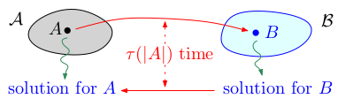
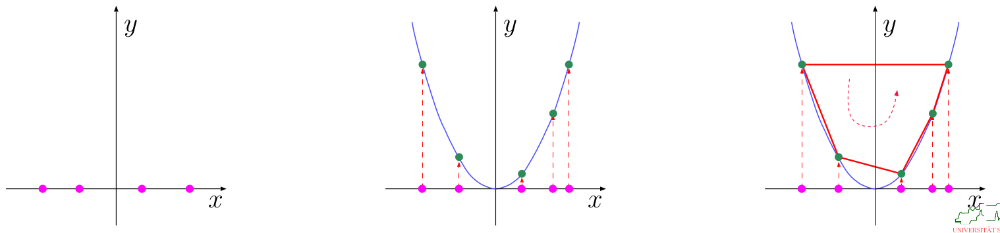
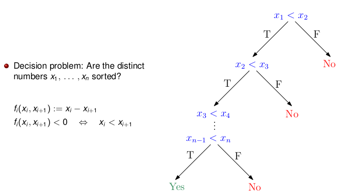

# Basics of Algorithm Theory

## Asymptotic Notation

| Notation Notation | Definition                                                   |
| ----------------- | ------------------------------------------------------------ |
| Big-O             | $O(f) := \{g:\mathbb{N} \rightarrow \mathbb{R}⁺ \hspace{0.5cm} | \hspace{0.5cm} \exists c \in \mathbb{R^+} \hspace{0.5cm} \exists n_0 \in \mathbb{N} \hspace{0.5cm} \forall n \geq n_0 \hspace{0.5cm} g(n) \leq c \cdot f(n)\}$ |
| Big-Omega         | $\Omega (f) := \{g: \mathbb{N} \rightarrow \mathbb{R⁺} \hspace{0.5cm}| \hspace{0.5cm} \exists c \in \mathbb{R^+} \hspace{0.5cm} \exists n_0 \in \mathbb{N} \hspace{0.5cm} \forall n \geq n_0 \hspace{0.5cm} c \cdot f(n) \leq g(n)\}$ |
| Big-Theta         | $\theta (f) := \{g: \mathbb{N} \rightarrow \mathbb{R⁺} \hspace{0.5cm}  | \hspace{0.5cm} \exists c_1,c_2 \in \mathbb{R⁺} \hspace{0.5cm} \exists n_0 \in \mathbb{N} \hspace{0.5cm} \forall n \geq n_0 \hspace{0.5cm} c_1 \cdot f(n) \leq g(n) \leq c_2 \cdot f(n)\}$ |
| Small-Oh          | $\Omega (f) := \{g: \mathbb{N} \rightarrow \mathbb{R⁺} \hspace{0.5cm}| \hspace{0.5cm} \forall c \in \mathbb{R^+} \hspace{0.5cm} \exists n_0 \in \mathbb{N} \hspace{0.5cm} \forall n \geq n_0 \hspace{0.5cm} g(n) \leq c \cdot f(n)\}$ |
| Small-Omega       | $O(f) := \{g:\mathbb{N} \rightarrow \mathbb{R}⁺ \hspace{0.5cm}| \hspace{0.5cm} \forall c \in \mathbb{R^+} \hspace{0.5cm} \exists n_0 \in \mathbb{N} \hspace{0.5cm} \forall n \geq n_0 \hspace{0.5cm} g(n) \geq  c \cdot f(n)$ |

 

## Sample growth rates

| Function                           | Asymptotic complexity            | Proof                                                        |
| ---------------------------------- | -------------------------------- | ------------------------------------------------------------ |
| $\theta(log_\alpha(n))$            | $\theta(log_\beta (n))$          | $log_\alpha( n) = \frac{1}{\log_\beta(\alpha)} \cdot log_\beta(n)$   for all  $\alpha,\beta \in \mathbb{R⁺} \setminus \{1\}$ and all $n \in N$ |
| $\theta(log(n!))$                  | $\theta(n \cdot log(n))$         | Using Stirling's formula: $n! \approx \sqrt{2\pi n} (\frac{n}{e})^n$ |
| $\theta(\sum_{K=1}^n \frac{1}{n})$ | $\theta(ln(n)) = \theta(log(n))$ | $lim_{n \rightarrow +\infty}(H_n - ln(n)) = \gamma$          |

#### Ackermann Function

The Ackermann function grows extremely rapidly. For example: $A(4,3) = 2^{2^{65536}}-3$  

$A(m,n) := \begin{cases} n+1 \hspace{5cm} \text{if } m=0 \\ A(m-1,1) \hspace{3.5cm}  \text{if } m > 0 \text{ and } n=0\\ A(m-1,A(m,n-1)) \hspace{1cm} \text{if } m > 0 \text{ and } n> 0\end{cases}$ 

#### Inverse Ackermann Function

The inverse Ackermann function grows extremely slowly. It is at most four for any input of practical relevance.

$\alpha(n):= \text{min}\{m \in \mathbb{N}: A(m,m) \geq n \}$

**Real-world occurence of $O(\alpha)$:** Combinatorial complexity of lower envelope of n
line segments.

#### Log-star (Iterated logarithm)

Log-star also grows very slowly. It's less than 6 for any input of practical relevance

$log^*(n):= \begin{cases} 0 \hspace{4.6cm}  \text{if } n \leq 1\\ 1+ log^*(log(n)) \hspace{1.2cm} \text{if } n > 1\end{cases}$ 

**Example:** 

$log^*(2^{16})=1+log^*(2^{2^2})=2+log^*(2^2)=3+log^*(2^1) = 4 + log^*(1)=4$

However, we have $\alpha \in o(log^*)$

#### Growth rate: $k+\epsilon$

A term of the form $k+\epsilon$ means that there is some additive positive constant $\epsilon \in \mathbb{R⁺}$ that needs to be added to $k$. The constant $\epsilon$ may be regarded as arbitary small but it will never equal zero.

Suppose that some algorithm runs in $2^c n^{1+1/c}$ time, where $c \in \mathbb{R^+}$ is a user-chosen constant:

- For $c:=2$, the complexity term equals $4n^{3/2}$, which is in $O(n^{3/2})$

- For $c:=9$, the complexity term equals $2^9n^{10/9}$, which is in $O(n^{10/9})$

- It is easy to see that $1+1/c$ approaches 1 as $c$ approaches infinity. However, $c$ cannot be set to infinity (or made arbitarily large) since then the $2^c$ term would dominate the complexity of our algorithm.

- Hence, the best possible way to express this complexity is to write $O(n^{1+\epsilon})$

## Master Theorem

Consider constants $n_0 \in \mathbb{N}$ and $a,b \in \mathbb{N}$ with $b \geq 2$ and a function $f: \mathbb{N} \rightarrow \mathbb{R}_0^⁺$. 

Let $f:\mathbb{N} \rightarrow \mathbb{R}_0^+$ be an eventually non-decreasing function such that 

$\hspace{2cm} T(n)=a \cdot T(\frac{n}{b})+f(n)$

for all $n \in \mathbb{N}$ with $n \geq n_0$, where we interpret $\frac{n}{b}$ as either $\lceil \frac{n}{b} \rceil$ and $\lfloor \frac{n}{b} \rfloor$.

Then we have

$T \in \begin{cases} \theta(f) \hspace{3cm} \text{if } f \in \Omega(n^{log_b(a)+\epsilon})\\ \theta(n^{log_b(a) \cdot log(n)}) \hspace{0.7cm} \text{if } f \in \theta(n^{log_b(a)})\\ \theta(n^{log_b (a)}) \hspace{1.8cm} \text{if } f \in O(n^{log_a(b)-\epsilon})\end{cases}$ 

## Complexity of an algorithm

#### Worst-case complexity

A *wort-case complexity* of an algorithm is a function $f: \mathbb{N} \rightarrow \mathbb{R}^+$ that gives an upper bound on the number of elemenatry operations (memory units, ...) used by an algorithm with respect to the size of its input, for all inputs of the same size.

#### Average-case complexity

An *average-case complexity* of an algorithm is a function $g: \mathbb{N} \rightarrow \mathbb{R}^+$ that models the average number of elementary operations (memory units, ...) used by an algoirhtm with respect to the size of its input.

#### Input size

The *size of the input* of an algoirhtm is a quantity that measures the number of input items relevant for elementary operations of the algorithm.

## Model of Computation 

#### Elementary Operation

An *elementary operation* is an operation whose running time is assumed not to depend on the specific values of its operands.

For example: The time taken by the comparison of two floating-point numbers is frequently assumed to be constant. 

Still, what constitutes an elementary operation depends on the model of computation.

#### Model of computation

A model of computation specifies the elementary operations that may be executed together with their respective costs.

**For example:** Turing Machine (TM) model. This model is often used when talking about theoretical issues like NP-completeness. But, the TM model is cumbersome to use for analyzing actual complexities and impractical for most "real" applications

Hence, several alternative models have been proposed:

- Random Access Machine (RAM) model

- Real RAM model

- Algebraic Decision/Computation Tree (ADT/ACT) model

- Blum-Shub-Smale model

##### Integer Random Access Machine

Every memory location can hold a single integer number.

The following operations are available at unit cost:

- Reading and writing (i.e., file I/O) of a number
- The three standard arithmetic operations: $+,-,\times$
- Comparison between two integers: $<, \leq, =, \neq,  \geq, >$
- Indirect addressing of memory

**Note:** The RAM model is not very very realistic. For instance, it allows solving PRIME in $O(nlog(log(n))$ time using the sieve of Eratosthenes.

##### Real random Access Machine

Every memory location can hold a single real(!) number.

The following operations are available at unit cost:

- Reading and writing (i.e., file I/O) of a real number
- The four standard arithmetic operations and square roots: $+,-,\times, \div,\sqrt{}$
- Comparisons between two reals: $<, \leq, =, \neq,  \geq, >$
- Indirect addressing of memory (for integer addresses only!)

Real RAM is a widely used model of computation, e.g., in geometric modeling and computational geometry. It's still unrealistic, though, since just one real number can encode an infinite amount of information.

The Real RAM is truly more powerful than the RAM. For example, given two finite sets $S$ and $T$ of positive integers, decide whether $\sum_{s \in S} \sqrt{s} > \sum_{t \in T} \sqrt{t}$

##### Floor function

A real RAM does not allow to convert between integer variables and real variables. In particular, it does not allow the use of the floor function $\lfloor \cdot \rfloor$

###### MAXGAP

**Given:** A set $S$ of $n \ge 2$ distinct (unsorted!) real numbers.

**Compute:** The maximum gap $\delta$ among the sorted numbers of $S$.

$\delta := max \{ y - x: x,y \in S \and x \le y \and \neg (\exists z \in S: x < z < y) \}$

MAXGAP has an $\Omega(nlogn)$ lower bound in the ACT model. Adding the floor function to the Real RAM allows to solve MAXGAP in $\theta(n)$ time.

## Reduction of a problem

#### Reduction

A problem $A$ can be reduced (or transformed) to a problem $B$ if

- every instance A of $A$ can be converted to an instance B of $B$

- a solution S for $B$ can be computed, and

- S can be transformed back into a correct solution for $A$.

#### $\tau$-Reducibility 

A problem $A$ is $\tau$-reproducible to $B$, denoted by $A \leq_{\tau} B$, if

- $A$ can be reduced to $B$
- for any instance A of $A$, steps 1 and 3 of the reduction can be carried out in at most $\tau(|A|)$ time, where $|A|$ denotes the input size of A.

#### Upper bound via reduction

Suppose that $A$ is reducible to $B$ such that the order of the input size is preserved. If problem $B$ can be solved in $O(T)$ time, then $A$ can be solved in at most $O(T+\tau)$ time.

#### Lower bound via reduction

Suppose that $A$ is $\tau$-reducible to $B$ such that the order of the input size is preserved. If problem $A$ is known to require $\Omega(\tau)$ time, then $B$ requires at least $\Omega(T-\tau)$ time.

##### Intuitive explanation

Let's assume that we are given an problem $A$ and we know that its complexity has a lower bound of $\Omega(T_A)$. It's important to emphasize that we can rely on this bound. On other words, we know that this bound is correct due to some proof we or somebody else has done previously.

Next, we reduce $A$ to a problem $B$. In other words, we find a transformation that can map any instance of $A$ to an instance of $B$. Now, let's assume that problem $B$ can be solved faster than $T_A$ and the transformation can done efficently (faster than $O(T_A)$). However, this would mean that we can solve $A$ by reducing it to $B$ faster than $\Omega(T_A)$ time. 

**Contradiction:** We know that such a solution for $A$ does not exist, hence, we also know that such a solution for $B$ cannot exist. Therefore, $B$ needs to have a lower bound of at least $\Omega(T-\tau)$.

#### Example: ELEMENTUNIQUENESS and SORTING

##### PROBLEM: ELEMENTUNIQUNESS

**Given:** A set $S$ of $n$ real numbers $x_1, x_2, ..., x_n$

**Decide:** Are any two numbers of $S$ equal?

##### LEMMA:

- ELEMENTUNIQUENESS can be solved in $O(f)+O(n)$ time if we can sort $n$ numbers in $O(f)$ time.
- SORTING requires $\Omega(f)$ time if ELEMENTUNIQUENESS requires $\Omega(f)$ time.

##### Proof:

**Given:**

- We know that SORTING can be solved in $O(f)$ time

- We know that ELEMENTUNIQUENESS requires at least $\Omega(f)$ time

Obviously, after sorting $x_1, x_2,..., x_n$ elements, we can solve ELEMENTUNIQUENESS in $O(n)$ time. Rest follows from definition of reduction.

#### Example: CLOSESTPAIR and ELEMENTUNIQUENESS

##### PROBLEM: CLOSESTPAIR

**Given:** A set of $S$ of $n$ points in the Euclidean plane

**Compute:** Those two points of $S$ whose mutal distance is minimum among all all pairs of points of $S$.

##### LEMMA:

- ELEMENTUNIQUENESS can be solved in $O(f) + O(n)$ time if CLOSESTPAIR can be solved in $O(f)$ time.
- CLOSESTPAIR requires $\Omega(f)$ time if ELEMENTUNIQUENESS requires $\Omega(f)$ time. 

##### Proof:

**Given:**

- We know that CLOSESTPAIR can be solved in $O(f)$ time.

- We know that ELEMENTUNIQUENESS requires at least $\Omega(f)$ time.

Reduce ELEMENTUNIQUENESS to CLOSESTPAIR:

- Let $S' := \{x_1, x_2, ..., x_n\}$ be an element of ELEMENTUNIQUENESS. Transform $S'$ into an element of CLOSESTPAIR by mapping every $x_i$ to an element $(x_i,0)$.  Obviously, the elements are unique if and only if the closest pair has non-zero distance. This transformation can be conducted in $O(n)$ time.

#### Example: SORTING and CONVEXHULL

##### PROBLEM: CONVEXHULL

**Given:** A set of $S$ of $n$ points in the Euclidean plan $\mathbb{R^2}$

**Compute:** The convex hull $CH(S)$ (the smallest convex super set of $S$)

##### Convex set

A set $X \subset \mathbb{R^2}$ is *convex* if for every pair of points $p,q \in X$ also the line segment $\bar{pq}$ is contained in $X$.

##### LEMMA:

- CONVEXHULL requires $\Omega(f)$ time if SORTING requires $\Omega(f)$ time.

##### Proof:

**Given:**

- We know that SORTING requires at least $\Omega(f)$ time

Suppose that $S' := \{ x_1, x_2, ..., x_n\}$ is an instance of SORTING. We transform it into an instance of CONVEXHULL by mapping every point $x_i$ to $(x_i,x_i^2)$. The convex hull of $S$ contains a list of vertices sorted by x-coordinates. One pass through this list will find the smallest element. The sorted numbers can
be obtained by a second pass through this list, at a total extra cost of $O(n)$ time.

## Decision Problems

#### Decision Problem

A problem is a *decision problem* if the output sought for a particular instance of the problem always is the answer YES / NO.

**Example:** Boolean satisfiability (SAT), "Are the numbers sorted?"

##### Problem: SAT

**Given:** A propositional formula $A$.

**Decide:** Is $A$ satisfiable? For instance, does there exist an assighnment of truth values to the Boolean variables of $A$ such that $A$ evaluates to true?

#### Algebraic Decision Trees

An *algebraic decision tree (ADT)* with input vector $(x_1, x_2, ..., x_n) \in \mathbb{R}^n​$ is a finite rooted binary tree where

- every internal node $v$ is given by a predicate

  $f_v(x_1, x_2, ..., x_n)  \hspace{0.5cm} ?  \hspace{0.5cm} 0$

- such that

  - $f_v: \mathbb{R}^n \rightarrow \mathbb{R}$ is a polynomial in $x_1, ..., x_n$ of degree deg($f_v$), and
  - "?" is a comparison operator ($<,\leq,\geq, >, \neq$)

- every leaf node is associated with $Yes$ and $No$

It solves a decision problem $P$ if its leaves are associated correctly with $Yes$ and $No$ relative to $P$ for every input $(x_1, x_2, ..., x_n)$. The algebraic degree of a decision tree with $k$ internal nodes $v_1, ..., v_k$ is given by the maximum degree of a polynomial at a node: max$_{1\leq i \leq k}$ deg($f_{v_i}$). An ADT is a *linear decision tree* if its algebraic degree is 1.

**Example: Linear Decision Tree**

Note that every comparison $x_1 < x_2$ splits $\mathbb{R}^2$ into two half-planes. It yields true if and only if $(x_1,x_2) \in \mathbb{R}^2$ is a member of $W := \{ (u_1, u_2) \in \mathbb{R}^2: u_1 < u_2\}$.

#### Membership set

For a decision problem P with input variables $x_1, x_2, ..., x_n \in \mathbb{R}^2$ we define $W_P$ as the set of points in $\mathbb{R}^n$ for which the answer to the decision problem is $Yes$.

$W_P := \{ (u_1, ..., u_n) \in \mathbb{R}^n: u_1, u_2, ..., u_n \text{ yield } Yes \text{ for } P\}$

The set $W_P$ is called the *membership set* of $P$. Furthermore, we denote $\bar{W_P}$ as the set of points in $\mathbb{R}^n$ for which the answer is $No$. Formally, we can define $\bar{W_P}$ as $\bar{W_P} := \mathbb{R}^n \setminus W_P$

##### Definition (45)

For a decision problem $P$ with input $x_1, x_2, ..., x_n \in \mathbb{R}$ and membership set $W_P$ we denote the number of disjoint connected components of $W_P$ by $\#(W_P)$ and the number of disjoint connected components of $\bar{W_P}$ by $\bar{\#(W_P)}$.

#### Linear Tree

In a linear decision tree at every internal node $v$ the predicate 
- $f_v(x_1, x_2, ..., x_n)  \hspace{0.5cm} ?  \hspace{0.5cm} 0$ 

corresponds to

- $a_0 + a_1 x_1 + a_2 x_2 + ... + a_n x_n  \hspace{0.5cm} ?  \hspace{0.5cm} 0$

Hence, every internal nodes defines a hyper-plane and we branch at that node depending on whether the input point is above, below, or on this hyper-plane

**Putting a lower bound on the height of the decision tree**

To investigate how complicated a problem is we need to identify how many comparisons are required to "solve" a problem.  Since we branch at every node, we need to look into the height of the decision tree.

Now, let's consider the set $R(v) \subseteq \mathbb{R}^n$ of points of $\mathbb{R}^2$ that reach some particular node $v$ of a linear decision tree. The set $R(v)$ contains all the points that satisfy a set of linear equalities and inequalities. Hence, $R(v)$ forms a convex polyhedron.

Next, we can conclude that every leaf $v$ of a linear decision tree corresponds to a convex set and connected set $R(v) \subseteq \mathbb{R}^n$. (By definition: A convex set is connected. And the intersection of two convex sets is
convex.)

Hence, every disjoint connected component of $W_p$ or $\bar{W_P}$ corresponds to one unique leaf of the decision tree. This implies a lower bound of $\#W_P + \bar{\#W_P}$ on the height of the decision tree and, therefore, also on the minimum number of comparisons that any decision algorithm which uses linear decisions has to make in the worst case.

##### Theorem (46): Dobkin & Lipton

The height $h$ of a linear decision tree is $h \geq log(\#W_P + \bar{\#W_P})$.

##### Theorem (47): Petrovskii & Oleinik, Thom, Milnor

Given a decision problem $P$ with $n$ variables. We get for the height $h$ of an algebraic decision tree of degree $d \geq 2$ that solves $P$:  $\hspace{1cm} h = \Omega(log_d(\#W_P + \bar{\#W_P})-n)$

#### Algebraic Computation Tree

An *algebraic computation tree* with input $(x_1, x_2, ..., x_n) \in \mathbb{R}^n$ solves a decision problem $P$ if it is a finite rooted tree with at most two children per node and two types of internal nodes.

**Computation:** 

A computation node $v$ has a value $f_v$ determined by one of the following instructions:

- $f_v = f_u \circ f_w$   or   $f_v = \sqrt{f_u}$

where $\circ \in \{ +, -, \cdot, \setminus \}$ and $f_u, f_w$ are values associated with ancestors of $v$, input variables or arbitrary real constants.

**Branch:**

A branch node $v$ has two children and contains one of the predicates

- $f_u > 0$        $f_u \geq 0$        $f_u = 0$

where $f_u$ is a value associated with an ancestor of $v$ or an input variable.

Every leaf node is associated with $Yes$ and $No$, depending on the correct answer for every $(x_1, x_2, ..., x_n)$ relative to $P$.

##### Theorem (49)

Given a decision problem $P$ on $n$ variables. If we exclude all intermediate nodes which correspond to additions,, substractions and multiplications by constants then we get for the height $h$ of an algebraic computation tree that solves $P$:

$\hspace{1cm} h = \Omega(log(\#W_P + \bar{\#W_P})-n)$$

#### Proofing a lower bound for ELEMENTUNIQUENESS

The following algorithm can solve ELEMENTUNIQUENESS without sorting the input first:

$\hspace{3cm} \prod_{1 \leq i \leq j \leq n} (x_i - x_j) \hspace{0.2cm} ?= 0$

**Case study if $n=3$:**

First, let's investigate our problem for $n=3$:

- $x_1 < x_2 < x_3​$
- $x_1 < x_3 < x_2$
- $x_2 < x_1 < x_3$
- $x_2 < x_3 < x_1$
- $x_3 < x_1 < x_2$
- $x_3 < x_2 < x_1$

If any of these inequalities is true, then all numbers are different and the answer to our decision problem is $No$. 

In other words, the subset $\bar{W_P}$ of $\mathbb{R}^3$ for which the answer is $No$ :

$\hspace{3cm} \bar{W_P} := \cup_{\pi \in S_3} \bar{W_{\pi}}$

with $\bar{W_{\pi}} := \{ (x_1, x_2, x_3) \in \mathbb{R}^3: x_{\pi(1)} < x_{\pi(2)} < x_{\pi(3)}\}$

Hence, for $n=3$ the number of disjoint connected components $\#\bar{W_P} = 6$ because each permutation $\pi$ results in its own connected component.

**The general case:**

We have know shown that $n=3$ leads to $6$ disjoint connected components.  However, to make sure that it suits for our problem, we need to generalize it. In fact, we need to show that every subset in $\bar{W_P}$ forms its own disjoint connected component.

- Let $\pi, \sigma \in S_n$ with $\pi \neq \sigma$. For $1 \leq i, j \leq n$ we define $f_{ij}(x_1, x_2, ..., x_n) := x_i - x_j$

- We can conclude that since $\pi \neq \sigma$, there exists $i \neq j$ such that 

  $f_{ij} > 0$     for all $p \in \bar{W_{\pi}}$      but $f_{ij}(p) < 0$    for all $p \in \bar{W_{\sigma}}$

- Are these points part of the same connect set? Let's recall what being in the same connected set actually means: It means that every point on a line connecting two points in a set is part of the connected set as well.

  In our case, any path from a point in $\bar{W_{\pi}}$ to a point in $W_{\pi}$ must go through a point $q$ where $f_{ij}(q)=0$.

  But we know that $q \in \bar{W_P}$. Hence,  $\bar{W_{\pi}}$ and  $\bar{W_{\sigma}}$ lie in two different connected components if $\pi \neq \sigma$.

- Since $|S_n| = n!$, we know that $\#\bar{W_P} \geq n!$

Finally, we can now conclude that the height $h$ of an ADT/ACT is $h = \Omega(log(n!) - n)$ 

This also means that $\Omega(log(n)!) = \Omega( n \cdot log(n))$ comparisons are necessary to solve ELEMENTUNIQUENESS in any ADT/ACT of fixed maximum degree for $n$ input numbers.

#### Theorem (50)

A comparison-based solution of ELEMENTUNIQUENESS for $n$ real numbers requires $\Omega(n \cdot log(n))$ comparisons.

#### Corollary (51)

A comparison-based SORTING of $n$ real numbers requires $\Omega(n \cdot log(n))$ comparisons.

#### Corollary (52)

A solution to CONVEXHULL computation requires $\Omega(n \cdot log(n))$ time in the ACT model in the worst case for $n$ points.

#### Corollary (53)

A solution to CLOSESTPAIR requires $\Omega(n \cdot log(n))$ time in the ACT model in the worst case for $n$ points.

#### Proofing a lower bound for MAXGAP and UNIFORMGAP

##### Problem: MAXGAP

**Given:** A set of $S$ of $n >2$ distinct (unsorted!) real numbers.

**Compute:** The maximum gap $\delta$ among the sorted numbers of $S$.

​                    $\delta := max\{y-x: x,y \in S \and x < y \and \neg (\exists z \in S: x < z < y)\}$

##### Problem: UNIFORMGAP

**Given:** A set $s := \{ x_1, x_2, ..., x_n\}$ of $n>2$ distinct (unsorted!) real numbers and $\delta \in \mathbb{R}^+$.

**Decide:** Is the gap between the sorted numbers of $S$ uniformly $\delta$?

​                $\exists \pi \in S_n$          $x_{\pi(i+1)} = x_{\pi(i)} + \delta$         for all $i \in \{1,2,...,n-1\}$

##### Proofing the lower bound for UNIFORMGAP

We first start by defining the membership set $W_P$ which includes all points for which the result of the ACT would be $Yes$.

The membership set is given by $W_P := \cup_{\pi \in S_n} W_\pi$

with $W_\pi := \{ (x_1, x_2, ..., x_n\}) \in \mathbb{R}^n: x_{\pi(i+1) = x_{\pi(i)}+\delta}$ for all $i \in \{ 1,2, ..., n-1\}$

We now consider the function $f_{ij} := x_i - x_j$   for   $1\leq i, j \leq n$.

For $\pi, \delta \in S_n$:  If $\pi \neq \sigma$ then at least one $f_{ij}$ must take different signs over $W_\pi$ and $W_\delta$.

Hence, any path leading from a point $W_\pi$ to a point in $W_\delta$ mast pass through a point $p$ of $\mathbb{R}^n$ with $f_{ij}(p)=0$. However, $p \notin W$ since $\delta$ is a real positive number. Therefore, the distance between two elements $x_i$ and $x_j$ can never be $0$.

Therefore, we can conclude that $W_\pi$ and $W_\sigma$ form different connected components of $W$ if $w \neq \delta$.

Since $|S_n| = n!$, we get $\#W_P \geq n!$ which establishes the lower $\Omega(n \cdot log(n))$ lower bound.

##### Theorem (54)

A solution to UNIFORMGAP for $n$ numbers requires $\Omega(n \cdot log(n))$ time in the ACT model.

##### Proofing the lower bound for MAXGAP

We can show a lower bound for MAXGAP by reducing UNIFORMGAP to MAXGAP.

Given an instance $\{x_1, x_2, ..., x_n\}$ and $\delta$ of the UNIFORMGAP problem. We first use MAXGAP algorithm to compute the maximum gap $\Delta$ of $n$ numbers.

If $\Delta \neq \delta$ then the answer is No. Otherwise, we compute $x_{min} := min \{x_1, x_2, ..., x_n\}$  and $x_{max} := max \{x_1, x_2, ...,x_n\}$ and check whether $x_{max}  - x_{min} = (n-1) \cdot \delta$.

Obviously, this algoirthm solves UNIFORMGAP in $O(n)$ time plus the time consumed by the MAXGAP algorithm.

##### Corollary (55)

A solution to MAXGAP for $n$ numbers requires $\Omega(n \cdot log(n))$ time in the ACT model.

