## Algorithmic Paradigms


### Incremental Construction


#### What is incremental construction?

A result $R(\{ x_1, x_2, ..., x_n\})$ that depends on $n$ input items $x_1, x_2, ..., x_n$ is computed by dealing with one element at a time: For $2 \leq i \leq n$, we obtain $R(\{ x_1, x_2, ..., x_i\})$ from $R(\{ x_1, x_2, ..., x_{i-1}\})$ by "inserting" the i-th item $x_i$ into $R(\{ x_1, x_2, ..., x_{i-1}\})$.

#### Important invariant of incremental construction

$R(\{x_1, x_2, ..., x_i\})$ exhibits all the desired properties of the final result $R(\{ x_1, x_2, ..., x_n \})$ restricted to $\{ x_1, x_2, ..., x_i\}$ as input items:  If we would stop incremental construction after having inserted $x_i$ then we would have the correct solution $R(x_1, x_2, ...,x_i\})$ for $\{x_1, x_2, ..., x_i\}$.

Note that once this invariant has been established the overall correctness of an incremental algorithm is a simple consequence. The total complexity is given as a sum of the complexities of the individual "insertions".

Incremental algorithms are particularly well suited for dealing with "online problems", for which data items arrive one after the other.

**Online algorithm:** Can process input data piece-wise
**Offline algorithm:** All input data need to be given from the beginning


#### Example: Insertion Sort

Insertion sort is a classical incremental algorithm: We insert the $i$-th item (of $n$ items) into the sorted list of the first $i-1$ items, thereby transforming it into a sorted list of the first $i$ items.

```python
InsertionSort(array, int low, int high):
	for ( i=low+1; high; ++i ):
		x = A[i]
		j = i
		while ((j >= 1) && (A[j-1] > x) ):
			A[j] = A[j-1]
			--j
		A[j] = x
```


##### Runtime complexity

**Worst case:** 

Occurs if input array is sorted in reverse order. Hence, the number of insert (incl. swaps) operations becomes

$\text{# inserts } = 1 + 2 + ... + n = \frac{n(n+1)}{2} \in O(n^2)$

**Best case:**

Occurs if the array is already sorted.

$\text{# inserts } = 1 + 1 + ... + 1 = n \in O(n)$

**Average case:**

On average, we expect that each element is less than half the elements to its left. Therefore, the running time would be half of the worst-case running time. Hence, we have an average complexity of $\theta(n^2)$


#### Example: Convex Hull


##### Problem: ConvexHull

**Given:** A set of $S$ of $n$ points in the Euclidean plane $\mathbb{R}^2$
**Compute:** The convex hull $CH(S)$, i.e., the smallest convex super set of $S$.

##### Lemma (58)

- The convex hull of a set $S$ of points in $\mathbb{R}^2$ is a convex polygon
- Two distinct points $p,q \in S$ define an edge of $CH(S)$ if and only if all points of $S \setminus \{ p,q\}$ lie on one side of the line through $p,q$.


##### Incremental Construction

- Sort the points according to their $x$-coordinates and re-number accordingly:
  $S := \{ p_1, p_2, ..., p_n\}$. (Suppose that all x-coordinates are distinct)

- Compute $CH(\{p_1, p_2, p_3 \})$

- Suppose that $CH(\{p_1, p_2, p_3\})$

  - Compute the supporting lines of $CH(\{ p_1, p_2, ..., p_{i-1}\})$ and $p_i$
  - Split $CH(\{ p_1, p_2, ..., p_{i-i}\})$ into two parts at the two vertices of $CH(\{p_1, p_2, ..., p_{i-1}\})$ where the supporting lines touch
  - Discard that part of $CH(\{ p_1, p_2, ..., p_{i-1} \})$ which faces $p_i$


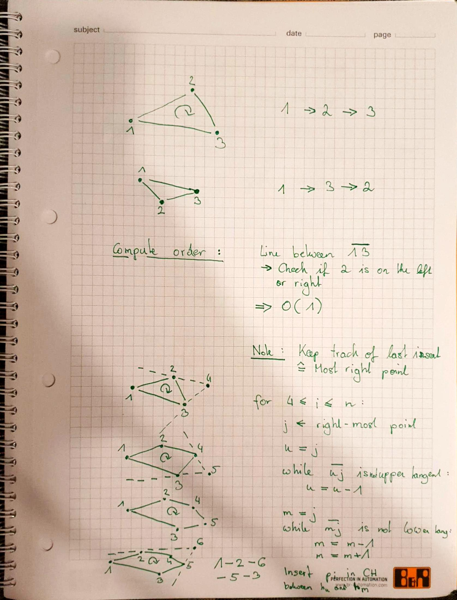


**Algorithm**

```
INCREMENTAL CONVEX HULL (S)

Sort the n belongs to S points by their x-coordinate
CH  ←  triangle (p1, p2, p3)
for (4 ≤ i ≤ n ) do
        j ←  Index of the rightmost point of CH

        // find the upper tangency point
        u = j
        while (pih4 is not tangent to CH) do
                if (u ≠  j) then
                        remove h4  from CH
                u = u -1

        // find the lower tangency point
        I = j
        while (pihl is not tangent to CH) do 
                if ( I ≠ u) then
                        remove hi from CH
                I = I + 1

        INSERT pi in CH between hu and hi
```


**Runtime complexity**

We know that sorting can be done in $O(n \cdot log(n))$ time. The construction of $CH(\{p_1, p_2, p_3\})$ takes $O(1)$ time. Inserting $p_i$ into $CH(\{p_1, p_2, ..., p_{i-1}\})$ will result in discarding one or more vertices of $CH(\{p_1, p_2, ..., p_{i-1}\})$ and, thus, takes $O(i)$ time.
Hence, we get $O(n \cdot log(n)) + O(1) + O(4+5+...+n) = O(n^2)$ as total time complexity.

But wait, is this a tight upper bound? Definitely not, since we need to take into account that whenever we remove an item from list, it doesn't have to be proceeded in the future. In other words, $m_4 + m_5 + ... + m_n < n$. Hence, the insert operation of an element $p_i$ runs in amortized time $O(1)$ and the total complexity of the incremental construction algorithm is $O(n \cdot log(n))$.

##### Theorem (59)

The convex hull of $n$ points  in a plane can be computed in worst-case optimal time $O(n \cdot log(n))$.


### Greedy Paradigm

A *greedy algorithm* attempts to solve an optimization problem by repeatedly making the locally best choice in a hope to arrive at the global optimum. However, a greedy algorithm may but not end up in the optimum.

Typically, if greedy algorithms are applicable to a problem then the problem tends to exhibit the following two properties:

-  **Optimal substructure:** The optimum solution to a problem consists of optimum solutions to its sub-problems.
- **Greedy choice property:** Choices may depend on prior choices, but must not depend on future choices; no choice is reconsidered

If a greedy algorithm does indeed produce the optimum solution then it's likely that the algoirthm of choice tends to be faste rthan other algorithms.

**Examples:** Kruskal's algorithm / Prim's algorithm for computing minimum spanning trees


#### Selection Sort

Selection sort is a classical greedy algorithm. We sort the array by repeatedly searching the k-smallest item and move it forward to make it the k-th item of the array.

```
SelectionSort(array A[], int low, int high):
	for (i = low; high; ++i):
		j_min = i
		for (j = low+1; high; ++j):
			if (A[j] < A[j_min]): 
				j_min = j
		if (j_min != i): 
			Swap(A[i], A[j_min])
```


**Runtime complexity:**

Obviously, selection sort runs in $O(n^2)$ time in both the average and the worst-case. The only advantage is that it requires only $O(n)$ write operations of array elements while insertion sort may consume $O(n^2)$ write operations.


#### Huffmann Coding

Huffmann coding is a so-called variable-length encoding scheme. While fixed-coding schemes (like ASCII) use a fixed number of bits to encode each symbol, variable-length encodes symbols that occur

- more frequently with shorter bit strings
- less frequently with longer bit strings

Obviously, such a code needs to be design in a smart way. If one would assign, say $1$ to "a" and $11$ to "q" then an encoding string that starts with $11$ cannot be decoded unambiguously.


##### Prefix code

Consider a set $\Omega$ of symbols. A *prefix code* for $\Omega$ is a function $c$ that maps every $x \in \Omega$ to a binary string, such that $c(x)$ is not a prefix of $c(y)$ for all $x,y \in \Omega$ with $x \neq y$.

If a code has this property we say that it has the *prefix property*.


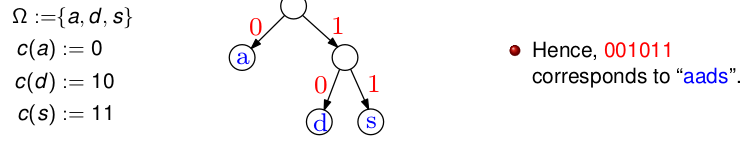


##### Lemma (61)

Let $T$ be the binary tree that represents $c$. If $c$ is a prefix code for $\Omega$ then only the leaves $T$ represent symbols of $\Omega$.


##### Average number of bits per symbol

Consider a set $\Omega$ of symbols and a frequency function $f: \Omega \rightarrow \mathbb{R}^+$. The *average number of bits per symbol* of a prefix code $c$ is given by 

$\hspace{7cm} ANBS(\Omega, c, f) := \sum_{\omega \in \Omega} f(\omega) \cdot |c(\omega)|$ 

where $|c(\omega)|$ denotes the number of bits used by $c$ to encode $\omega$.


##### Optimum prefix code

A prefix code $c*$ for $\Omega$ is *optimum* if it minimizes $ANBS(\Omega, c,f)$ for a given frequency $f$.


##### Lemma (64)

If a prefix code $c*$ is optimum then the binary tree that represents $c*$ is a **full** tree. (every non-leaf node of $T$ has two children)


##### Lemma (65)

The lowest-frequency symbol of $\Omega$ appears at the lowest level of the tree that represents an optimum prefix code $c*$.


##### Huffman's greedy template

- Create two leaves for the two lowest-frequency symbols $s_1, s_2 \in \Omega$
- Recursively build the encoding tree for $\Omega \cup \{ s_{12}\}  \setminus \{s_1, s_2\}$ with $f(s_{12}) := f(s_1) + f(s_2)$ where $s_{12}$ is a new symbol that does not occur in $\Omega$.


##### Theorem (66)

Huffman's greedy algorithm computes an optimum prefix code $c*$ for $\Omega$ relative to  a given frequency $f$ of the symbols of $\Omega$.


#### Job Scheduling


##### Problem: JobScheduling

**Given:** A set $J$ of $n$ jobs, where job $i$ starts at time $s_i$ and finishes at time $f_i$. Two jobs $i$ and $j$ are $compatible$ if they do not overlap time-wise. For example, if either $f_i \leq s_j$ or $f_j \leq s_i$.

**Compute:** A maximum subset $J'$ of $J$ such that the jobs of $J'$ are mutually compatible.


##### There are different methods for sorting our jobs

- **Fewest conflicts:** Pick jobs according to smallest number of incompatible jobs
- **Shortest job duration:** Pick jobs according to ascending order of $f_i - s_i$
- **Earliest start time:** Pick jobs according to ascending ordre of $s_i$
- **Earliest finish time:** Pick jobs according to ascending order of $f_i$


##### Lemma (67)

Picking jobs according to **earliest finish time** allows to compute an optimum solution to **JobScheduling** in $O(n \cdot log(n))$ time for $n$ jobs.


##### Earliest finish time algorithm

```
# A => List of jobs

A ← sort_according_to_finish_time(A)
for j = 1 to n:
	if (job j compatible with A)
	A ← A ∪ {j}
return A
```


**Proof by contradiction:**

We now assume that our Greedy-strategy does **not** produce the correct result.

Suppose that an optimum solution has $m$ jobs while a greedy approach picks $k < m$ jobs $i_1, i_2, ..., i_k$. 

Now, we are going to show that such a set (not equal to the optimum solution) cannot exist.

Therefore, we first need to label the sets as follows:

Let $x$ be the largest-possible number such that $i_1=j_1$, $i_2 = j_2$, ..., $i_x = j_x$ over all optimum solutions $j_1, j_2$, ..., $j_m$. Obviously, we have $x < m$.

Next, we assume that there is a job $i_{x+1}$ that finishes before $j_{x+1}$. So, why not exchanging the job with $f_{j_{x+1}}$ of our optimum solution? Although, the optimum solution would remain optimal, it would violate the maximiality of $x$.

The optimum solution still remains optimal, but it violates the maximality of $x$.


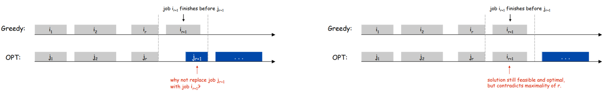


##### Problem: ProcessorScheduling

**Given:** A set $J$ of $n$ jobs, where job $i$ starts at time $s_i$ and finishes at time $f_i$. Two jobs $i$ and $j$ are compatible if they do not overlap time-wise.

**Compute:** An assignment of a all jobs to a minimum number of processors such that no two incompatible jobs run on the same processor.


##### Lemma (68)

Assigning jobs to earliest start time allows to compute an optimum solution to ProcessorScheduling in $O(n \cdot log(n))$ time.


#### Optimal Offline Caching

Let's consider cache memory with a capacity to store $k$ items. A sequence of $n$ items arrive one after the other, where same item may arrive multiple times.

- Every item is brought into the cache upon arrival unless it is already stored in the cache
- If storing a newly arrived item would exceed the cache capacity then one item has to be evicted from the cache in order to free space for a new item: **cache miss**

Consider a cache of capacity $2$ and the following sequence of items: a,b,c,b,c,a,a,b

**Goal:** Minimize the number of cache misses

**Note:** We differ between offline caching and online caching. For offline caching the sequence of the items to be stored is know prior to the arrival of the first item.


##### Problem: OfflineCaching

**Given:** A cache with capacity $k$ and a sequence of $n$ items which are to be stored in the cache.

**Compute:** An eviction strategy that minimizes the number of cache misses.


##### Caching / Eviction strategies

- **Last in, first out (LIFO):** Evict item brought into cache most recently

- **First in, first out (FIFO):** Evict item brought into cache least recently

- **Least recently used (LRU):** Evict item whose most recent access was earliest

- **Least frequently used (LFU):** Evict item that was least frequently requested

- **Farthest in future (FF):** Evict item in the cache that is not requested until farthest in the future (Clairvoyant algorithm)


**Note:** it is not easy to see that LIFO, FIFO, LRU and LFU need to form an optimum eviction strategy


##### Lemma (69)

There exists an optimum evication strategy that bring an item into the cache no earlier than at the item when it is requested.

Note: Obviously, we do not gain anything by bringing an item into the cache at a time when the item is not requested.


##### Theorem (70)

The farthest-in-future strategy is an optimum evication strategy.


##### Online caching

- One of the most fundamental online problem of CS

- LIFO can be arbitarily bad

- LRU is k-competitive 


**Note:** Competitive analysis compares the performance of an optimal online algorithm to an optimal offline algorithm. Thus, k-competitive means that there is an offline algorithm which performs at most k-times worse than an online algorithm


### Divide & Conquer


#### Basic principle

Split the problem into sub-problems, recursively solve the sub-problems and then merge the solutions of the subproblems to obtain the solution for the original problem.

**Note:** It's important to divide the jobs evenly. Nevertheless, we don't have to split every sub-problem at half. It's good enough to ensure that the size of every sub-problem is at most some constant fraction of the original problem size.

#### Merge Sort

```
MergeSort( array A[], int low, int high):
	int i
	int middle
	if (low < high):
		middle = (low+high)/2
		MergeSort(A, low, middle)
		MergeSort(A, middle+1, high)
		Merge(A, low, middle, high)
```


#### Fast exponentiation

Suppose that we need to compute $a^n$ for some large $n \in \mathbb{N}$. 

A naive recursive solution would look as follows:

$a^n := \begin{cases} a \hspace{2.5cm} \text{if } n \text{ is odd} \ \\ a^{n-1} \cdot a \hspace{1.1cm} \text{if } n \text{ is even}\end{cases}$

Obviously, this approach requires $n-1$ multiplications.


We could also make use of the fact that $n = \lceil \frac{n}{2} \rceil + \lceil \frac{n}{2} \rceil$ and resort to exponentiation by squaring:

$a^n := \begin{cases} a \cdot (a^{(n-1)/2})^2\hspace{1cm} \text{if } n \text{ is odd}  \\ (a^{1/2})^2 \hspace{2.5cm} \text{if } n \text{ is even}\end{cases}$

This will consume $\theta(log(n))$ muplications since $n$ is at least halved during each call to exponentiation, at the cost of at most two muplications per call.


**Example:** 

a         a          a          a         a

a         a       

a


#### Fast Matrix Multiplication

**Recall:** If $A$, $B$ are two squared matrices of size $n$ x $nx$ then, $A \cdot B$ is the $n$ x $n$ matrix $C = [c_{ij}]$ whose (i,j)-th element $c_{ij}$ is defined by the formula:

$\hspace{4cm} c_{ij} := \sum_{k=1}^n a_{ik} \cdot b_{kj} = a_{i1} b_{1j} + ... + a_{in} b_{nj}$

Obviously, the multiplication of two $n$ x $n$ matrices results in $\theta(n^3)$ many arithmetic operations.


##### Theorem (71)

Seven multiplications of scalars suffice to compute the multiplication of two 2x2 matrices. In general, $O(n^{log_2(7)}) \approx O(n^2.807)$ arithmetic operations suffice for $n$ x $n$ matrices. The algorithm is called *Strassen Algorithm*.


Strassen's algorithm is more complex and numerically less stable than the standard naive algorithm. But it is considerably more efficient for large $n$ ($n>100$). Although, it does not assume multiplication to be commutative and, thus, works over arbitrary rings.


##### Example: Simple Divide & Conquer:

- Divide matrices $A$ and $B$ in 4 sub-matrices of size $n/2$ x $n/2$ as shown in the below diagram.

- Calculate following values recursively. ae + bg, af + bh, ce + dg and cf + dh.


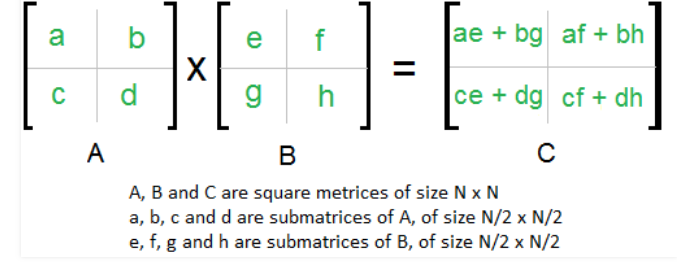


As we can see we need to perform 8 multiplications and 4 additions.  Hence the complexity according to the Master theorem becomes:

$T(N) = 8 T(N/2) + O(n^2)   \hspace{2cm} \rightarrow  \hspace{2cm} \theta(n^3)$


##### Example: Strassen algorithm

The idea of Strassen’s method is to reduce the number of recursive calls to 7. Strassen’s method is similar to above simple divide and conquer method in the sense that this method also divide matrices to sub-matrices of size $n/2$ x $n/2$.


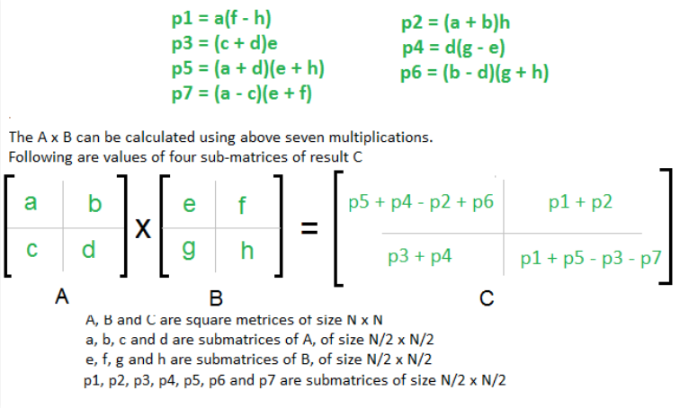

Strassen's algorithm can multiply to matrices by means of 7 multiplications and 18 additions/substractions of $m$ x $m$ matrices.

Obviously, one addition of two $m$ x $m$ matrices takes $O(m^2)$ time. Let $T(n)$ denote the number of (arithmetic) operations consumed by Strassen's algorithm for multiplying two $n$ x $n$ matrices. We get the following recurrence relation for $T$.

$T(n) = 7 \cdot T(\frac{n}{2}) + O(n^2)$

Hence, the Master Theorem yield $ T \in \theta(n^{log_2(7)}) \approx \theta(n^{2.807})$

 

##### Further algorithms

- Coppersmith & Winograd:	$O(n^{2.375})$
- Stothers: $O(n^{2.37369})$
- Williams: $O(n^2.37286)$

The Coppersmith-Winograd algorithm and the more recent improvements are used frequently as building blocks in other algorithms to prove complexity bounds. Besides Strassen’s algorithm, these algorithms are of no practical value, though, since the cross-over point for where they would improve on the naive cubic-time algorithm is enormous.

**Note:** Lower bound for fast matrix multiplication is still unknown.


#### Closest Pair

##### Problem: ClosestPair

**Given:** A set $S$ of $n$ points in the Euclidean plane

**Compute:** Those two points of $S$ whose mutual distance is minimumg among all pairs of points of S$.


##### Lemma (75)

ClosestPair for $n$ points can be solved in worst-case optimal time $O(n \cdot log(n))$.


##### Proof: 1-D

- Divide the points $S$ into two sets $S_11$, $S_2$ by some x-coordinate so that $p < q$ for all
  $p \in S_1$ and $q \in S2$.
- Recursively compute closest pair $(p_1, p_2)$ in $S_1$ and $(q_1, q_2)$ in $S_2$.
- Let $\delta$ be the smallest separation so far: $\delta = min(|p_2-p_1|, |q_2-q_1|)$
- The closest pair is $\{p_1, p_2\}$, or $\{q_1, q_2\}$, or some $\{p_3, q_3\}$ where $p_3 \in S_1$ and $q_3 \in S_2$.
- If $m$ is the dividing coordinate, then $p_3$, $q_3$ must be within $\delta$ of $m$.
- In 1D, $p_3$ must be the rightmost point of $S_1$ and $q_3$ the leftmost point of $S_2$. Howver, this does not generalize for higher dimensions.
- At most one point can lie in the intervall $(m-\delta, m ]$. Same applies for $S_2$

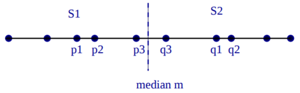


**Recurrence:** $T(n) = 2T(n/2) + O(n)$


##### Proof: 2-D

- Partition $S$ into $S_1$, $S_2$ by vertical line $l$ defined by median x-coordinate in $S$.

- Recursively compute closest pair distance $\delta_1$ and $\delta_2$.

- Set $\delta = min(\delta_1, \delta_2)$

- Compute the closest pair with one point each in $S_1$ and $S_2$


  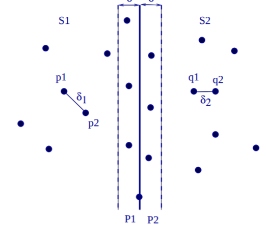

- In each candidate pair $(p, q)$, where $p \in S_1$ and $q \in S_2$, the points $p$, $q$ must both lie within $\delta$ of $l$.

- We show that points in $P_1$, $P_2$ ($\delta$ strip around) have a special structure, and solve the conquer step faster.

- We show that points in $P_1$, $P_2$ ($\delta$ strip around) have a special structure, and
  solve the conquer step faster.

  Consider a point $p \in S_1$. All points of $S_2$ within distance $\delta$ of $p$ must lie in a $\delta$ x $2 \delta$ rectangle $R$.

  All points of $S_2$ within distance $\delta$ of $p$ must lie in a $\delta$ x $2 \delta$ rectangle $R$.

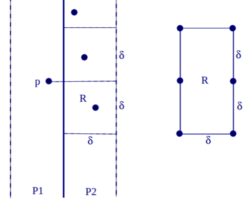

​	How many points can be inside $R$ if each pair is at least $\delta$ apart? **At most 6!** 

​        So, we only need to perform $6 \cdot n/2$ distance comparisons.


**Complexity:**

- Sorting according to x-coordinates takes $O(n \cdot log(n)$ time.

- Splitting $n$ vertices at median x-coordinate takes $O(n)$ time

- The distance computations take $O(1)$ time for each position of the sliding windows

- Thus, all distance computations carried out during the conquer step run in $O(n)$ time

- Merging the y-sorted points of the left and right sub-set takes $O(n)$ time

- Hence, for the time complexity $T(n)$ we get

  $T(n) = 2T(\frac{n}{2}) + O(n)$    resulting in $T \in O(n \log(n))$

  and thus an overall $O(n \cdot log(n))$ time bound.


### Dynamic Programming

Dynamic programming (DP) is a technique for efficently implementing a recursive algorithm by storing results for sub-problems. It may be applicable if the naive recursive algorithm would solve the same sub-problem over and over again. In that case, storing the solution for every sub-problem in a table to look up instead of re-compute may lead to a more efficient algorithm. Of course, there is always a trade-off between space and time.

If applicable, dynamic programing combines the best of both worlds for two common paradigms to solve optimization problems:

- As a greedy algorithm it tends to be reasonably fast
- As exhaustive search it will determine the true optimum


Note that Dynamic Programming may result in an efficient (sub-exponential) algorithm if the following conditions hold:

- a solution can be computed by combining solutions of sub-problems

- a solution of every sub-problem can be computed by combining solutions of sub-subproblems

- only a polynomial number of sub-problems occurs in total


**Different types**

- Momoization (top down)

  - Apply standard recursion, but remember the solution to a previously solved sub-problem
  - Re-use solution whenever a sub-problem is encountered that has already been solved

- Tabulation (bottom up)

  - Build a table of solutions for the sub-problems in bottom-up fashion

**Performance:**
- If all subproblems must be solved at least once, a bottom-up dynamic-programming algorithm usually outperforms a top-down memoized algorithm by a constant factor.
  - No overhead for recursion and less overhead for maintaining table
  - There are some problems for which the regular pattern of table accesses in the dynamic-programming algorithm can be exploited to reduce the time or space requirements even further.
- If some subproblems in the subproblem space need not be solved at all, the memoized solution has the advantage of solving only those subproblems that are definitely required

**Complexity:** Roughly, we get the number of sub-problems times the complexity for solving every sub-problem


#### Theorem (76)

Dynamic programming allows to solve TSP for $n$ cities in $O(n^2 2^n)$ time.


#### Fibonacci numbers

The Fibonacci numbers are defined as follows:

$F_n := \begin{cases} n \hspace{4cm} \text{if } n \leq 1 \\ F_{n-1}  + F_{n-2} \hspace{1.5cm} \text{if } n \geq 2 \end{cases}$


**Example:** 0, 1, 1, 2, 3, 5, 8, 13, 21, 34, ...

Since the Fibonacci numbers are defined recursively, a recursive computation scheme seems natural. Note that this requires Fibonacci numbers to be computed over and over again. For example, $F_{n-4} is computed five times from scratch.

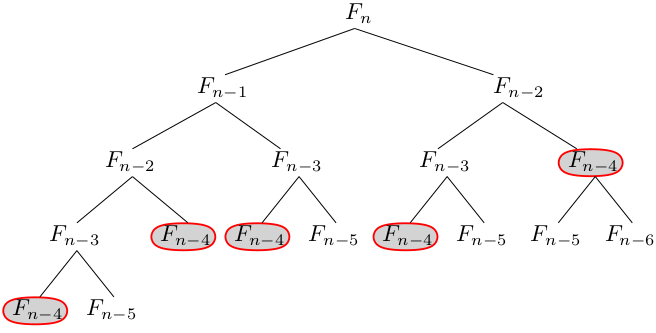


##### Lower bound

$C(n) := C(n-1) + C(n-2) + c$

$C(n)  := C(n-2) + C(n-3) + C(n-2) + c + c$

$C(n) := 2C(n-2) + C(n-3) + a \geq 2C(n-2) + a$


$C(n) := 2C(n-2) + a = 2(C(n-3) + C(n-4) + c) + a = 2C(n-3) + 2C(n-4) +a + a$
$C(n) := 2(C(n-4) + C(n-5) + c) + 2C(n-4) +  a + a$
$C(n) := 2C(n-4) + 2C(n-5) + 2c + 2C(n-4) + a + a$
$C(n) := 4C(n-4) + 2C(n-5) + 2a + a$
$C(n) \geq 4C(n-4)  + 2a + a$


$C(n) := 4C(n-4) + 2a + a = 4(C(n-5) + C(n-6) + c) + 2a +a$
$C(n) := 4C(n-5) + 4C(n-6) + 2a + 2a + a$
$C(n) := 4(C(n-6) + C(n-7) + c) + 4C(n-6) + 2a + 2a + a$
$C(n) := 4C(n-6) + 4C(n-7) + 4C(n-6) + 4a + 2a + a$
$C(n) := 8C(n-6) + 4C(n-7) + 4a + 2a + a$
$C(n) \geq 8C(n-6) + 4a + 2a + a$


$C(n) := 2^b C(n-2b) + a(2^{b-1} + 2^{b-2}  + 2 + 1)$

Substitution stops when $b = n/2$:

$C(n) := 2^{n/2} C(0) + a(2^{b-1} + 2^{b-2}  + 2 + 1) \geq m \cdot 2^{n/2}$

Hence, Fibonacci is in $\Omega(2^{n/2}) = \Omega(\sqrt{2}^n) \approx \Omega(1.41^n)$


##### Upper bound

We know that: $C(n-2) \leq C(n-1)$, $C(n-3) \leq C(n-2)$, ..., $T(n-k) \leq T(n-k+1)$

$C(n) := C(n-1) + C(n-2) + c \leq 2C(n-1) + c$

By substitution:

$C(n) < 2^k \cdot C(n-k) + c \cdot (2^{k-1} + 2^{k-2} + ... + 2^2 + 2 +1)$

Substitution stops when $n-k=1​$. Hence,  $k=n-1​$

$C(n) := O(m \cdot 2^{n-1}) \leq O(m \cdot 2^n)$

Hence, Fibonacci is in $O(2^n)$.


 ##### Tighter upper bound

We can also show a tighter upper bound by means of the following lemma:


**Lemma**

For $n \in \mathbb{N}$ with $n \geq 2$:

$F_n = \frac{1}{\sqrt{5}} \cdot (\frac{1+\sqrt{5}}{2})^n - \frac{1}{\sqrt{5}} \cdot (\frac{1-\sqrt{5}}{2}) ^n\geq (\frac{1+\sqrt{5}}{2})^{n-2}$


$O(F_n)  = O(\frac{1}{\sqrt{5}} \cdot (\frac{1+\sqrt{5}}{2})^n) - O(\frac{1}{\sqrt{5}} \cdot (\frac{1-\sqrt{5}}{2})^n)$

Hence, $C \in O(\phi^n)$ with the golden ratio $\phi := \frac{1+\sqrt{5}}{2}$


##### Application of Dynamic Programming

A simple button-up approach suffices to compute the n-th Fibonacci number in $O(n)$ steps (if we ignore the time needed to add large intergers).

```
fibonacci(int number):
	n1 = 0
	n2 = 0
	tmp, i
	for (i=1; i<number; ++i):
		temp = n1 + n2
		n1 = n2
		n2 = temp
	return n2
```


#### Matrix Chain Multiplication

The standard method for multiplying a $p$ x $q$ matrix with a $q$ x $r$ matrix requires $p \cdot q \cdot r$ (scalar) multiplications and $p \cdot (q-1) \cdot r$ additions, yielding a result matrix of size $p \cdot r$.

Recall that matrix multiplication is associative, but not commutative:

$(A \cdot B) \cdot C = A \cdot (B \cdot C)$,       but, in general,   $A \cdot B \neq B \cdot A$

Hence, if $A$ is a 100x1 matrix, $B$ is a 1x100 matrix, and $C$ is a 100x1 matrix, then

- $(A \cdot B) \cdot C$ needs $(100 \cdot 1 \cdot 100) + (100 \cdot 100 \cdot) = 20000$ multiplications.

- $A \cdot (B \cdot C)$ needs $(1 \cdot 100 \cdot 1) + (100 \cdot 1 \cdot ) = 200$ multiplications

   

Therefore, it's obvious that it may pay off to think about an optimal parenthesization.


##### Problem: MatrixChainMultiplication

**Given:** A sequence of $n$ matrices $A_1, A_2, ..., A_n$ where matrix $A_i$ has dimensions $d_{i-1}$ x $d_i$ for $i \in \{1, 2, ...,n\}$.

**Compute:** An optimal parenthesization such that the standard computation of $A_1 \cdot A_2 \cdot ... \cdot A_n$ results in the minimum number of multiplications.


We can split the product of matrices into two product by multiplying the first $k$ matrices, multiplying the second $n-k$ matrices and then multiplying the two resulting matrices:

$\hspace{4cm} A_1 \cdot A_2 \cdot ... \cdot A_n = (A_1 \cdot ... \cdot A_k) \cdot (A_{k+1} \cdot ... \cdot A_n)$


**Optimality Observation:**

If an optimal solution for $A_i \cdot ... A_j$ is given by $(A_i \cdot ... \cdot A_k) \cdot (A_{k+1} \cdot ... \cdot A_j)$ for $1 \leq i \leq k < j \leq n$ then also the parenthesizations of $A_i \cdot ... \cdot A_k$ and $A_{k+1} \cdot ... \cdot A_j$ need to be optimal.


##### Finding the optimal parenthesization by means of DP

For $1 \leq i \leq j \leq n$ let $m[i,j]$ denote the minimum number of scalar multiplications needed to compute $A_i \cdot ... \cdot A_j$

Recall that multiplying two matrices $A$ of size $p \cdot q$ and $B$ of size $q \cdot r$ results in a matrix of size $p \cdot r$.

Hence, the following formula can be used to estimate the minimum number of multiplications for a sequence.

$m[i,j] = \begin{cases} 0 \hspace{10cm} \text{if } i = j \\ min \{ m[i,k] + m[k+1, j] + d_{i-1} d_k d_j\} \hspace{1.6cm}\text{ if } i < j\end{cases}$


**Algorithm:**

```
MatrixChainMultiplication(int d[], int s[]):
	
	int seq_len, cost
	int N = d.length - 1
	
	for(i=1; i<=N; i++): 
		m[i,i] = 0
	
	for (seq_len=2; i <= N - seq_len +1; ++i):
		for (i=1; i<=N-seq_len+1; ++i):
			j = i + seq_len - 1
			m[i,j] = MAXINT
			for(k=i; k <= j-1; ++k):
				cost = m[i,k] + m[k+1,j] + d[i-1] * d[k] * d[j]
				if (cost < m[i,j]):
					m[i,j] = cost
					s[i,j] = k
	
```


Now, the perfect parenthesization can be extracted from s[]:

```
string GetParenthesization(int i, int j, int s[]):
	if (i < j):
		x = GetParenthesization(i, s[i,j], s)
		y = GetParenthesization(s[i,j] + 1, j, s)
		return "(x * y)"
	else
		return "A_" # IntToString(i)
```


##### Theorem (77)

MatrixChainMultiplication can be solved in $O(n^3)$ time and $O(n^2)$ space for $n$ matrices.


#### Minimum-Weight Triangulation


##### Simple polygon

A simple (closed) polygon with vertices $p_1, p_2, ..., p_n$ is a sequence of $n$ straight-line segments ("edges") $\bar{p_1 p_2}$, $\bar{p_2 p_3}$, ..., $\bar{p_n p_1}$ such that no two edges intersect except for subsequent edges sharing a common vertex.


##### Diagonal

A *diagonal* of a simple polygon $P$ with vertices $p_1, p_2, ..., p_n$ is a straight-line segment $\bar{p_i p_j}$ defined by two distinct and non-consecutive vertices $p_i$, $p_j$ of $P$ which lies completely within the area bounded by $P$.


##### Triangulation

A triangulation of a simple polygon $P$ with $n$ vertices is a partitioning of the area bounded by $P$ into $n - 2$ triangles by inserting $n-3$ diagonals which do not intersect each other except for possibly sharing common vertices of $P$.


##### Problem: MinimumWeightTriangulation (MWT)

**Given:** A simple polygon $P$ with $n$ vertices.

**Compute:** A triangulation $T$ of $P$ such that the sum of the edge lengths of the diagonals of $P$ that induce $T$ is minimum over all triangulation of $P$.


##### Optimality observation

If we knew that a diagonal - say $v_2 v_5$ - occurs in a MWT of $P$, then we could obtain the full MWT by computing MWTs for the two sub-polygons induced by the diagonal.

Again, simply enumerating all diagonals and recursively finding the MWT would be too costly.


##### Lemma (81)

Consider a $n$-vertex convex polygon $P$. Select on edge of $P$ and denote it by $r$. There is a bijection between the triangulations of $P$ and full binary trees with $n-1$ leaves if we match the edge $r$ with the root of the tree.

**Proof:**

- Every triangulation of $P$ corresponds to a unique full binary tree with $n − $1 leaves
  such that the root of the tree corresponds to $r$. (Every triangle corresponds to
  one inner node.)

- Every full binary tree with $n − 1$ leaves corresponds to a unique triangulation of $P$
  such that the root of the tree corresponds to the triangle attached to $r$ .


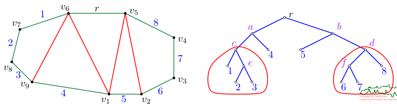

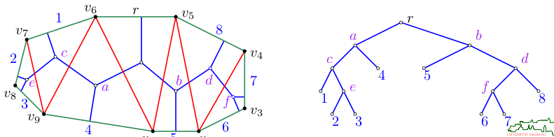


##### Lemma (82)

Consider an $n$-vertex convex polygon $P$. Select one edgje of $P$ and denote it by $r$. Label the other edges of $P$ by $A_1$, $A_2$, ..., $A_{n-1}$ in CCW order, start at $r$. Then there exists a bijection between the triangulations of $P$ and parenthesizations of the matrix chain product $A_1 \cdot A_2 \cdot ... \cdot A_{n-1}$.

**Proof:**

- Every triangulation of $P$ corresponds to a unique parenthesization of $A_1 \cdot A_2 \cdot ... \cdot A_{n-1}$.
- Every parenthesization of $A_1 \cdot A_2 \cdot ... \cdot A_{n-1}$ corresponds to a unique triangulation of $P$.


##### Detailed explanation 

Our purpose is to find the triangulation of P that has the minimum total length. Namely, the total length
of diagonals used in the triangulation is minimized. We would like to compute the optimal triangulation using divide and conquer. As the figure on the right demonstrate, there is always a triangle in the triangulation, that breaks the polygon into two polygons. Thus, we can try and guess such a triangle in the optimal triangulation, and recurse on the two polygons such created. The only difficulty, is to do this in such a way that the recursive subproblems can be described in succinct way.

To this end, we assume that the polygon is specified as list of vertices 1 . . . n in a clockwise ordering. Namely, the input is a list of the vertices of the polygon, for every vertex, the two coordinates are specified. The key observation, is that in any triangulation of P, there exist a triangle that uses the edge
between vertex 1 and n (red edge in figure on the left). In particular, removing the triangle using the edge 1− n leaves us with two polygons which their vertices are consecutive along the original polygon.

Let M[i, j] denote the price of triangulating a polygon starting at vertex i and ending at vertex j, where every diagonal used contributes its length twice to this quantity, and the perimeter edges contribute their length exactly once. We have the following "natural" recurrence:

$M[i,j] = \begin{cases} 0 \hspace{10.2cm} \text{if } i \leq j \\ 0 \hspace{10.2cm} \text{if } j = i +1 \\ min_{i<k<j} \Delta(i,j,k) + M[i,k] + M[k,j] \hspace{2cm} \text{otherwise} \end{cases}$


Where $\Delta(i,j,k) = Dist(i,j) + Dist(j,k) + Dist(i,k)$.

Note, that the quantity we are interested in is M[1, n], since it the triangulation of P with minimum total weight.

Using dynamic programming (or just memoization), we get an algorithm that computes
optimal triangulation in $O(n^3)$ time using $O(n^2)$ space.


##### Theorem Hu&Shing (83)

MinimumWeightTriangulation can be solved in $O(n \cdot log(n))$ time and $O(n)$ space for a convex polygon with $n$ verties.

##### Corollary Hu&Shing (84)

MatrixChainMultiplication can be solved in $O(n \cdot log(n))$ time and $O(n)$ space for $n$ matrices.


##### Important:

- Note that the following greedy approach need not yield the optimum:
  - Select the cheapest diagonal.
  - Recurse within the two sub-polygons induced.

- However, this greedy approach gives a triangulation that is within a constant
  factor of the optimum for convex polygons.

- It is easy to extend the DP approach to general polygons while maintaining the
  $O(n^3)$ worst-case complexity.
- If we do not care about weights then a simple polygon can be triangulated in
  linear time (Chazelle 1991)
- Several practical algorithms that run in expected near-linear time are known.


#### Number of Full Binary Trees


##### Theorem

A full binary tree with $m$ internal nodes has $m+1$ leave nodes.

**Proof by Induction:**

**IH:** 

​         $l_m = m+1$

**IB:** 

For the base case, if $I = 0$ then the tree must consist only of a root node, having no children because
the tree is full. Hence there is 1 leaf node.

**IS:**
We need to show that $I_{m+1} = (m+1)+1 = m+2$.

Let $T$ be a full binary tree with $m+1$ internal nodes. Then the root of $T$ can be split into two subtrees $L$ and $R$.

Let's say that $L$ has $k$ internal nodes and therefore $R$ needs to have $(m+1)-k-1=m-k$ internal nodes.
Please note that $m+1 = k + (m+1)-k-1 + 1$.

Now, by the induction hypothesis $L$ must have $k+1$ leaves and $R$ must have $m-k+1$ leaves.
$l_{m+1} = (k+1) + (m-k+1) = m+2 = (m+1)+1$

​            

##### Lemma (85)
There are $C_m$ different full binary trees with $m+1$ leaves.

**Proof:**

For $m \in \mathbb{N}_0$ , let $T_m$ denote the number of different full binary trees with $m$
internal nodes, i.e., with $m + 1$ leaves. Obviously, $T_0 = 1$.

Now, consider a full binary tree with $m \geq 1$ internal nodes, and thus, $m+1$ leave nodes. 
Such a tree consists of a left subtree with $k$ internal nodes and a right subtree with $m-1-k$ internal nodes, for some $k \in \{ 0,1, ..., m-1 \}$. For any fixed particular $k \in \{ 0,1,...,m-1\}$ we get $T_k$ different subtrees and $T_{m-1-k}$ different right subtrees.

Hence, $T_m$ fulfilles the recurrence:

$T_m = \sum_{k=0}^{m-1} T_k \cdot  T_{m-1-k}$        with $T_0=1$

This is the recurrence for the Catalan numbers and we get $T_m = C_m$.


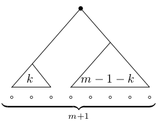


##### Corollary (86)

There are $C_{n-2}$ many different triangulations of convex polygon with $n$ vertices.

**Proof:**

A bijection between triangulations of a convex n-gon and full binary trees with $n-1$ leaves was established in Lemma 81.

From Lemma 85 we know that there are $C_m$ different full binary trees with $m+1$ leaves.

$n-1$ leaves = $(n-2)+1$ leaves

$C_m = m+1 $

$C_{n-2} = (n-2) + 1$


##### Corollary (87)

There are $C_{n-1}$ many different parenthesizations of the matrix chain product $A_1 \cdot A_2 \cdot  ... \cdot A_n$.

**Proof:**

A bijection between triangulations of a convex n-gon and parenthesizations of
the matrix chain product $A_1 \cdot A_2 \cdot . . . A_{n−1}$ was established in Lem. 82.

We transform the matrix chain product $A_1 \cdot A_2 \cdot ... \cdot A_{n}$ into a triangulation. The triangulation can be transformed in a full binary tree with $n$ leaves (Lemma 81).

$n$ leaves = $(n-1)+1$ leaves

$C_m = m+1$

$C_{n-1} = (n-1)+1$


##### Corollary (88)

The numbers of different triangulations of a convex polygon with $n$ vertices and of different full binary trees with $n$ leaves are exponential in $n$.

**Proof based on Lemma:**

$C_n = \frac{1}{n+1} \sum_{i=0}^n \binom{n}{i}^2 = \frac{1}{n+1} \binom{2n}{n} \in \theta (\frac{4^n}{n^{1.5}})$


#### Optimal Static Binary Search Tree


##### What is a binary search tree?

A Binary Search Tree is a node-based binary tree data structure which has the following properties:

- The left subtree of a node contains only nodes with keys lesser than the node’s key.

- The right subtree of a node contains only nodes with keys greater than the node’s key.

- The left and right subtree each must also be a binary search tree.

However, the question is how to arrange the keys of the tree to minimize the cost for searching an element. As we have to "pay" for every comparison we want to make sure that element which are accessed frequently occur farther up in the tree.


##### Problem: OptimalStaticBinarySearchTree

**Given:** A sorted set $K$ of $n$ keys $k_1$, $k_2$, ..., $k_n$ where the i-th key will be searched with probability $p_i$ for $i \in \{ 1,2, ..., n\}$.

**Compute:** A binary search tree such that the expected search cost $\sum_{i=1}^n (1+ level(k_i)) \cdot p_i$ is minimum over all binary search trees, where level($k_i$) denotes the level of $k_i$ in the tree.

Optimal binary search trees are used for word prediction and completion:

- As an online dictionary or search engine has received more and more queries, it can assign weights to the corresponding words according to their frequency in the queries.
- These weights can be used to arrange the words such that likely completions of incomplete search entries can be found quickly.


**Example:**

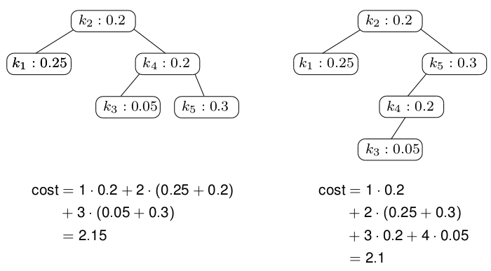

**IMPORTANT:** A deeper tree may have lower expected cost!


##### Lemma (89)

Dynamic programming allows to solve OptimalStaticBinarySearchTree in $O(n^3)$ time for $n$ keys.

TODO: Example Algorithm


##### Theorem (90)

OptimalStaticBinarySearchTree can be solved in $O(n^2)$ time and space for $n$ keys.


In 1975 Mehlhorn suggested a simple algoirthm that computes a near-optimum binary search tree in $O(n)$ time:

- Choose the root of the tree such that the sums of the weights of the left and right subtrees are balanced as good as possible.
- Apply this scheme recursively for each subtree.


### Deterministic vs. Randomized Algorithm


#### Deterministic algorithm

- It will always produce the same output in repeated runs for a particular input
- The underlying state machine will always pass through the same sequence of states for the same input


#### Randomized algorithm

- It uses a random number at least once to make a (branching) decision
- Repeated runs for the same input may result in different outputs or running times
- Probability of generating incorrect output
- Efficiency is guaranteed only with some probability


Note that randomization and probabilistic methods play a key role in modern algorithm theory: Randomized algorithms are often simpler to understand and implement, while being correct and efficient with high probability.


#### Random Numbers

"Classical" approaches like the rolling of dice or the flipping of coins cannot be used by computers. Alternatively, we can measure some physical phenomenon that can be expected to be random. For instance, the seconds of the current wall-clock time can be expected to yield a random number between 0 and 59.
Most Unix/Linux-like operating systems have */dev/random*, which allows to access environmental noise collected from source like device drivers. The second alternative is to use an algorithm to generate [sic!] random numbers: *pseudorandom number generator*
Pseudorandom numbers are a sequence of apparently random numbers which are completely determined by an initial value, known as *seed*.
A pseudorandom number generator will, by its very nature, never yield "true" random numbers in the purest sense of the world. But generators exist which are widely regarded to be sufficient even for security-critical applications.

#### Monte Carlo vs. Las Vegas

##### Monte Carlo algorithm:

- Is always fast
- Might fail to produce a correct output with one-sided or two-sided errors
- The probability of an incorrect output is bound based on an error analysis
- Repetitions of Monte Carlo algorithms tend to drive down the failure probability exponentially


##### Las Vegas algorithm

- Always gives a correct output (or reports an error)

- Its run-time performance may vary


Several Las Vegas algorithms can be turned into Monte Carlo algorithms by
setting a time budget and stopping the algorithm once this time budget is
exceeded..


#### Random Permutation


##### Problem: RandomPermutation

**Given:** A sequence $S=(s_0, s_1, ..., s_{n-1})$ of $n$ entities.

**Compute:** A random permutation of these $n$ entities, uniformly at random.


##### Algorithm

```
# Knuth Shuffle

void RandomPermutation(array S[]):
	N = S.length-1
	for (i = N; i >= 1; --i):
		j = RandomInteger({0,1,...,i})
		Swap(S[i], S[j])
```


- Knuth's version runs in $\theta(n)$ time
- After RandomPermutations(S) we have Pr[s=$s_i$]=$\frac{1}{n}$ for all $s \in S$ and all $i \in \{0,1,...,n-1\}$
- Hence RandomPermutation(S) generates each permutation with probability $\frac{1}{n!}$ uniformly at random.


**Knuth Shuffle vs. Naive Permutation**


**Version 1**

```
void shuffle(array S[]):
	N = S.length-1
	for (i=0; i<=N; i++):
		j = random({0,1,...,N})
		Swap(S[i],S[j]) 
	return S
```

What's the problem with this approach? Well, the permutations are not uniformly distributed. In other words, some permutation are more likely to occur than others. This is obviously bad!

**How to proof?** 	Permutate the sequence (A,B,C) and count the resulting permutations.


**Version 2**

```
void shuffle(array S[]):
	N = S.length-1
	copy = []
	
	for (i=0; i<=N; i++):
		j = random({0,...,S.length-1})
		copy[i] = S[j]
		del S[j]
	
	return copy
```

The above mentioned algorithm indeed solves the problem of Version 1. All permutations are equally likely to be chosen. However, there's another problem with this solution. Deletion elements from an array means that we have to resize the array. The cost for such delete operations are on average $O(\frac{n-1}{2})$. Hence, the complexity of the shuffle algorithm becomes $O(n^2)$ time.


**Version 3 (Knuth Shuffle)**

Knuth Shuffle resolves both issues. It's complexity is $O(n)$ and all permutations are guaranteed to occur equally likely.


