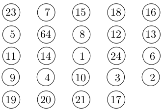
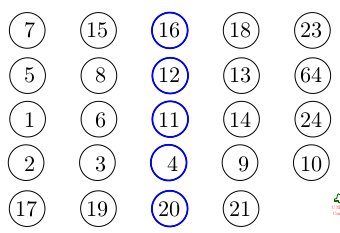
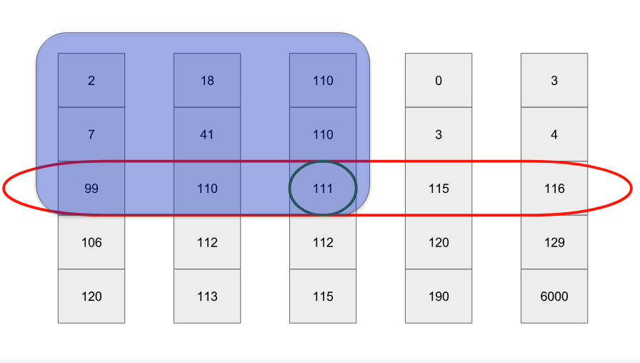
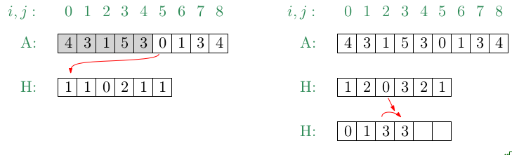
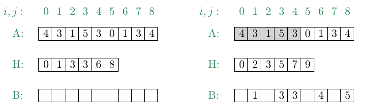
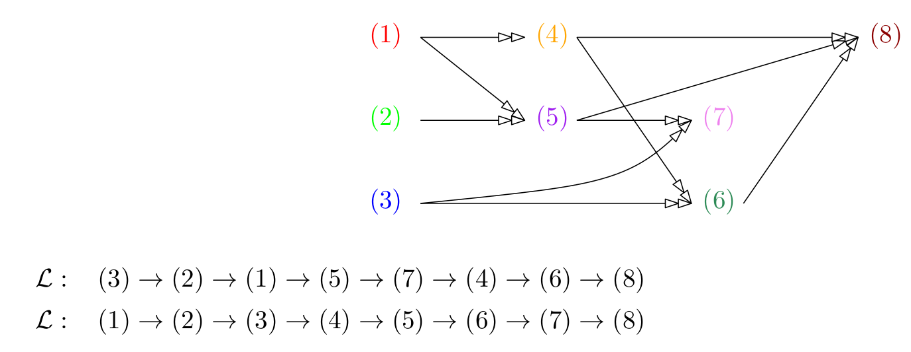

## Linear-Time Selection


### Order statistic

Consider a finite (totally-ordered) set $S$ of $n$ distinct elements and a number $k$ , for
$k , n \in \mathbb{N}$. An element $x \in S$ is the $k$-th smallest element of $S$, aka the $k$-th order
statistic, if $|\{s ∈ S : s < x\}| = k − 1$. If $k = \lceil \frac{n}{2} \rceil$ then the $k$-th smallest element of $S$ is
also called the median of $S$.


### Problem: Selection

**Given:** A set $S$ of $n$ distinct (real) numbers and a number $k$, for $k,n \in \mathbb{N}$.

**Compute:** The $k$-th smallest element of $S$.

Not that, if $k=1$ or $k=n$ then Selection can be solved easily using $n-1$ comparisons.
Furthermore, if the numbers of $S$ are arranged in sorted order then the $k$-th smallest element can be found in $O(n)$ time (or even faster).


### Deterministic Linear-Time Selection Algorithm

1. Divide the $n$ elements of $S$ into $\lfloor n/5 \rfloor$ groups of 5 elements each and (at most) one group containing the remaining $n$ mod 5 elements.



2. Sort each group and compute its median.

   

3. Recursively find the median $s$ of the $\lceil n/5 \rceil$ medians found in the previous step.

4. Partition $S$ relative to the median-of-medians $s$ into $S_L$ and $S_R$ (and $\{s\}$) such that all elements of $S_L$ are smaller than $s$ and all elements $S_R$ are greater than $s$.

   

5. Let $m := |S_L \cup \{s\}|$. If $k=m$ then return $s$. Otherwise, if $k<m$ then recurse on $S_L$ to find the k-th smallest element, else (if $k>m$) recurse on $S_R$ to find the (k-m)-th smallest element.


### Theorem (105)

Selection among $n$ distinct numbers can be solved in $O(n)$ time, for any $n,k \in \mathbb{N}$.

**Proof:**

1. Divide of the elements into sets of 5.
2. Find the median of each of the $\lceil n/5 \rceil$ groups by first insertion-sorting the elements of each group (of which there are at most 5) and then picking the median from the sorted list of group elements. Insertion of an element in one group takes constant time (due to its fixed size). $O(n)$
3. Use SELECT recursively to find the median $x$ of the $\lceil n/5 \rceil$ medians found. $O(\lceil \frac{n}{5} \rceil)$
4. Partitioning of all elements can be done in $O(n)$ 
5. Recursion: Complexity is determined by the size of $S_L$ and $S_R$. Therefore, we need to calculate how many elements can be in both sets.



​	

We know try to bound the number of elements in $S_R$. At least half of the medians are greater than or equal to the median-of-medians $x$. Thus, at least half of the $\lceil n/5 \rceil$ groups contribute at least 3 elements that are greater than $x$, except for the one group that has fewer than 5 elements if 5 does not divide $n$ exactly, and the one group containing $x$ itself.

​                                                          $|S_R| \geq 3( \lceil \frac{1}{2} \lceil\frac{n}{5} \rceil - 2\rceil ) \geq \frac{3n}{10} - 6$

Now, it's also easy to bound the size of $S_L$.

​                                                          $|S_L| < n - \frac{3n}{10} - 6= \frac{7n}{10}+6$

We can now develop a recurrence for the worst-case running time $T(n)$ of the algorithm SELECT.

​                                                          $T(n) = T(\lceil \frac{n}{5} \rceil) + T(\frac{7n}{10} +6) + O(n)$

We show that the running time is linear by substitution. More specifically, we will show that $T(n) \leq cn$ for some suitably large constant $c$ and all $n > 0$. We begin by assuming that $T(n) \leq cn$ for some suitably large constant $c$ and all $n < 140$; this assumption holds if $c$ is large enough.

$T(n) \leq c \lceil n/5 \rceil + c(7n/10 +6) + an$

$T(n) \leq c n/5 +c + 7cn/10 +6c + an = 9cn/10 +7c + an$

$T(n) \leq  cn + (-cn/10 +7c +an)$

which is at most $cn$ if $-cn/10 +7c +an \leq 0$

Solving this inequality for $n=140$ shows that $c \leq 20a$. The worst-case running time of SELECT is therefore linear.

##### Caution:

- Unfortunately, the constant hidden in the O-term is fairly large: Depending on details of the actual implementation, this algorithm requires about 50n comparisons! Hence, linear-time selection is too slow to be useful in practice.

- Worst-Case Complexity: $T \in O(n)$


### Expected Linear-Time Selection

1. Pick an element $s$ uniformly at random from $S$
2. Partition $S$ relative to $s$ into $S_L$ and $S_R$ such that all elements of $S_L$ ares smaller than $s$ and all elements of $S_R$ are greater than $s$.
3. Let $m := |S_L \cup \{s\}$. If $k=m$ then return $s$. Otherwise, if $k <m$ then recurse on $S_L$ to find the k-th smallest element, else (if $k>m$) recurse on $S_R$ to find the (k-m)-th smallest element.


**What is the complexity of an randomized algorithm?**

**Worst case:** If $s$ is the smallest or largest element of $S$ then $S$ shrinks by only one element, and we get $O(n^2)$ complexity. The probability of consistently picking an element of $S$ which currently is the smallest or largest is

$\hspace{8cm} \frac{2}{n} \cdot \frac{2}{n-1} \cdot \frac{2}{n-2} \cdot ... \cdot \frac{2}{3} \cdot \frac{2}{2} = \frac{2^{n-1}}{n!}$

**Best case:** The element $s$ turns out to be the k-th smallest element with probability $1/n$.

**Expected complexity:**

Let $T(n)$ be an upper bound on the expected time to process a set $S$ with $n$ (or fewer) elements. We say that $s$ is luck if it lies between the 25th and the 75th percentile of $S$. In other words, $s$ is lucky if $|S_L| \leq 3n/4$ and $|S_R| \leq 3n/4$. Since $s$ is chosen uniformly, both events occur with the same probability of $1/2$.

This gives us:

$T(n) \leq \text{Time to partition} + \text{Maximum expected time for recursion}$

$T(n) \leq n + \text{Pr(s is lucky)} \cdot T(\frac{3n}{4}) + \text{Pr(s is unlucky)} \cdot T(n)= n + \frac{1}{2} T(\frac{3n}{4}) + \frac{1}{2} T(n)$

Hence, after substracting $\frac{1}{2}T(n)$ from both sides, we get:

$T(n) \leq T(\frac{3n}{4}) + 2n$


$T(n) \leq T(9n/16) + 2n + 3n/2 = T(27n/64) + 2n + 3n/2 + 9n/8$ 

$T(n) \leq T(81n/256) + 2n + 3n/2 + 9n/8  + 27n/32 \leq 8n$


### Theorem (106)

A simple randomized algorithm solves Selection in expected linear time.


### Counting Sort

- Counting Sort can be used for sorting an array $A$ of $n$ elements whose keys are integers within the range [0,k-1], for some, $n,k \in \mathbb{N}$.

- It is stable, but not in-place.

  **Stable:** A sorting algorithm is said to be **stable** if two objects with equal keys appear in the same order in sorted output as they appear in the input array to be sorted.

  **In-place:** An in-place sorting algorithm uses constant extra space for producing the output (modifies the given array only)

- It uses indices into an array and, thus, is not a comparison sort.


**Algorithm:**

1. Compute a histogram $H$ of the number of times each element occurs within $A$.

2. For all possible keys, do a prefix sum computation on $H$ to compute the starting index in the output array of the elements which have that key.

   

3. Move each element to its sorted position in the output array $B$.

   


```
CountingSort(array A[], array B[], array H[], int n, int k):
	
	for (i=0; i<k; ++i)	H[i]=0
	for (j=0; j<k; ++j)	H[A[j]] += 1
	
	total = 0
	for (i=0; i<k; ++i):
		oldCount = H[i]
		H[i] = total
		total += oldCount
		
	for (j=0; j<n; ++j):
    	B[H[A[j]]] = A[j]
    	H[A[j]] += 1
```


#### Theorem (107)

Counting Sort is a stable sorting algorithm that sorts an array of $n$ elements whose keys are integers within the range [0, k − 1], for some $n,k \in \mathbb{N}$, within $O(n+k)$ time and space.


### Radix Sort

- Radix Sort can be used for sorting an array $A$ of $n$ elements whose keys are d-digit (non-negative) integers, for some $n,d \in \mathbb{N}$.
- It compares keys on a per-digit basis and, thus, is NOT a comparison sort. 
- It is stable, but not in-place


```
RadixSort(array A[], int n, int d):
	for (i = 1; i <= d; ++i):
		use stable sort to sort (counting sort) A[] relative to digit i
```


#### Theorem (108)

Radix Sort is a stable sorting algorithm that can be implemented to sort an array of $n$
elements whose keys are formed by the Cartesian product of $d$ digits, with each digit
out of the range [0, k − 1], within $O(d(n + k ))$ time and $O(n + k )$ space, for $n, d, k \in \mathbb{N}$.

**Complexity:**

- The for-loop runs $d$ times ($d$ digits). Hence, $O(d)$
- In every for-loop we apply counting sort. The complexity of counting sort is $O(n+k)$.

Hence, the overall complexity becomes $O(d(n+k))$.

**Correctness proof:**

**IB:**  

Suppose that we have a number with $d=1$ digits. Obviously, if we sort such numbers, we will obtain the right sorting.

**IH:**

After the $k$-th loop, where $k = 1, 2, . . . , d$, the sequence is sorted on the lower $k$ digits.

**IS:**

We will now proof it for the $(k+1)$-th step. Now, based on the induction hypthesis we assume that the numbers are sorted according to the first $k$-th numbers after the $k$-th loop. We now need to show that after the $(k+1)$-th loop, we know that the sequence is sorted according to the $(k+1)$-th number. 

To prove this, let $a_i$, $a_j$ two elements from A with the lower $k$ digits of $a_i < a_j$.

- If the $(k+1)$-th digits of $a_i$ and $a_j$ are different, then the k-th digit of $a_i$ must appear before $a_j$.
- If the $(k+1)$-th digits of $a_i$ and $a_j$ are the same, the right sorting depends on the other $k$ elements. Our induction hypthesis guarantees that $a_i$ appears before $a_j$. Since Counting sort is *stable* the order is preserved. $a_i$ still appears before $a_j$ after the $(k+1)$-th loop.

Therefore, we can conclude that the numbers are sorted correctly after the $(k+1)$-th loop.


### Topological Sorting


#### Problem: TopologicalSorting

**Problem:** A directed graph $G=(V,E)$

**Compute:** A linear ordering of the vertices of $V$ - if it exists -  such that for all $u,$v$ \in V$ the vertex $u$ comes before the vertix $v$ if $E$ contains the directed edge $uv$.





#### Lemma (109)

A directed graph $G$ admits a linear ordering of its vertices according to topological sorting if and only if $G$ does not contain a directed cycle, i.e., if and only if $G$ is a DAG.


#### Theorem (110)

In time $O(|V | + |E|)$ we can compute a linear ordering of the vertices of a directed graph $G = (V , E)$ according to topological sorting, or determine that the graph contains a directed cycle.


#### Algorithm

```
TopologicalSort(graph G=(V,E)) {
	L = {};
	S = list of all nodes of V with no incoming edges;
	while (S != {}) {
		remove front node u from S;
		add u to end of L;
		for (each edge e=(uv)) {
			remove edge e from E;
			if (v has no other incoming edges) {
				add v to end of S;
			}
		}
	}
	if (E != {}) 
		return error("graph has directed cycle");
	else
		return L;
}
```

- A depth-first search is an alternative to Kahn’s algorithm
- Topological sorting can be used to solve the single-source shortest-path problem in a weighted directed graph in $O(|V | + |E|)$ time.


