## Priority Queues

### Priority Queue

A priority queue (PQ) is an ADT that arranges data elements according to per-element keys ("priorities"): In a minimizing (maximizing, resp.) PQ the element with smallest (largest, resp.) overall key is served first.

- Keys need to belong to a totally ordered set.
- Standard operations for minimizing PQs:
  - **FindMin:** return element with smallest key
  - **DeleteMin:** return and remove element with smallest key from PQ
  - **Insert:** insert a new element
  - **DecreaseKey:** decrease the key of an element
  - **Remove:** remove an element from PQ
  - **Merge:** merge (aka meld) two PQs

**Note:** Standard implementation of PQ: Binary heap

### Binomial Tree

A binomial tree is an ordered rooted binary tree is defined recursively as follows:

- A binomial tree of order 0 consists only of the root node
- For $k \in \mathbb{N}_0$, a binomial tree of order $k+1$ consists of two binomial trees of order $k$ such that one binomial tree is the left-most substree of the other.

#### Lemma (112)

For $k \in \mathbb{N}_0​$, a binomial tree of order $k​$ has $k​$ subtrees (from left to right) of orders $k-1​$, $k-2​$, ..., $1​$, $0​$

**Proof:**

Consider a binomial tree $B_k$ of order $k$.

**IB:**
Consider a binomial tree $B_k$. It's order is $1$. Obviously, the tree comprises of $1$ subtree of order $1$.

**IH:**
A binomial tree $B_k$ consists of $k$ subtrees of the orders $k-1​$, $k-2​$, ..., $1​$, $0​$.

**IS:**
We consider a bionmial tree $B_{k+1}$ of order $k+1$. According to the definition of a binomial tree it comprises of two binomial trees $B_{k}$. Applying the induction hypothesis to $B_k$ tells us that the binomial tree comprises of subtrees of $B_{k-1}$, $B_{k-2}$, ..., $1$, $0$. Hence, we have $B_k$, $B_{k-1}$, $B_{k-2}$, ..., $1$ in total.

#### Lemma (113)

For $k \in \mathbb{N}_0$, a binomial tree of order $k$ has $2^k$ nodes and height $k$.

**Proof:**

**IB:**
It's easy to see that a binomial tree $B_0$ consists of $1$ node. (Definition)

**IH:**
A binomial tree of order $k$ has $2^k$ nodes and height $k$.

**IS:**
Consider a binomial tree $B_{k+1}$. By definition a binomial tree comprises of two binomial trees $B_k$. Due to IH we know that both trees have $2^k$ nodes.
Since $2^k + 2^k = 2^{k+1}$ we know that a binomial tree has $B_{k+1}$ has $2^{k+1}$ nodes in total.

#### Lemma (114)

For $k \in \mathbb{N}_0$, a binomial tree of order $k$ has $n \choose d$ nodes at depth $d$.

### Binomial Heap

A binomial heap is a collection of binomial trees that satisfy the binomial heap property:

- Each binomial tree is a min heap, i.e., for all nodes $v$ of the binomial tree, all keys of the children of $v$ are greater than (or at most equal to) the key of v.
- For any $k \in \mathbb{N}_0$, there is at most one binomial tree of order $k$.
- The binomial trees are arranged in a right-to-left sorted sequence according to their orders, with the tree of smallest order being right-most.

#### Lemma (116)

For $n \in \mathbb{N}_0$ a binomial heap with a total of $n$ nodes contains a binomial tree of order $k$ if and only if the bit that corresponds to $2^k$ in the binary representation of $n$ is 1.

**Proof:**

Every natural number can be uniquely represented as binary number. From lemma 113 we know that a binomial tree of order $k$ has $2^k$ nodes. We can construct a binomial heap that comprises of different unique binomial trees $B_k$ where the $k$-th bit is set to $1$. Hence, the sum of all nodes in the binomial heap becomes:

​                                                     $n = \sum_{i=0; i\text{-th bit is } 1}^K 2^i $       

#### Merging Binomial Heaps

- We visit the binomial trees of both binomial heaps according to increasing order $k$, starting with $k:=0$.

  - If both heaps and the carry contain exactly...
  	- no binomial tree of order $k$: Do nothing
  	- one binomial tree $B_1$ of order $k$: Move $B_1$ to the result
  	- two binomial trees $B_1$, $B_2$ of order $k$: Merge $B_1$ and $B_2$ into a tree $B$ of order $k+1$ and move $B$ to the carry.
  - three binomial trees $B_1$, $B_2$, $B_3$ of order $k$: Merge $B_1$ and $B_2$ into a tree $B$ of order $k+1$ and move $B$ to the carry. Move $B_3$ to the result.
- Increment $k$ after processing the bionomial trees of order $k$.

#### Lemma (117)

Merging two binomial heaps with a total of $n$ nodes takes $O(log(n))$ time.

**Proof:**

The representation of any decimal number requires at most $\lfloor log(n) \rfloor + 1$ bits. Hence, lemma 116 tells us that we need at most $\lfloor log(n) \rfloor + 1$ binomial trees. Hence, we need to perform $O(log(n))$ trivial merges of two binomial trees of the same order. Each such merge takes $O(1)$ time.

#### Lemma (118)

A new element can be inserted into a binomial heap with a total of $n$ nodes in $O(log(n))$ worst-case and $O(1)$ amortized time.

**Proof:**

- **Worst-case:**
  A new heap that contains only the new element and merge it with the old heap. Hence the worst-case complexity is $O(log(n))$.

- **Average Case:**
  **Aggregate method:** When does the i-th tree need to be changed?
  - The 1st tree gets added / removed every time
  - The 2nd tree gets added / removed every second time
  - The 3rd tree gets added / removed every fourth time

​	Hence, for a sequence of $n$ inserts we get:

​	   $\sum_{i=1}^n \lfloor \frac{n}{2^{i-1}} \rfloor \leq \sum_{i=0}^n n \sum_{i=1}^{n-1} \frac{1}{2^i} = 2n$

​	Therefore, the inserts can be done in amortized $O(1)$.

#### Lemma (119)

Finding the minimum element in a binomial heap with a total of $n$ nodes takes $O(log(n))$ time.

**Proof:**
It suffices to inspect the roots of all binomial trees. There are $\lfloor log(n) \rfloor +1$ trees.
Obviously, be keeping a pointer to the root with minimum key, this time can be reduced to $O(1)$.

#### Lemma (120)

The minimum element can be deleted from a binomial heap with a total of $n$ nodes in $O(log(n))$ time.

**Proof:**
The minimum can be found in $O(log(n))$ time. 
By removing the root / binomial tree we split one binomial tree into a sequence of subtrees which in turn are binomial heap. Now, we merge this new binomial heap with the rest of the original binomial heap. This can be done in $O(log(n))$ time.

#### Lemma (121)
The key of a known element of a binomial heap with a total of $n$ nodes can be decreased in $O(log(n))$ time. 

**Proof:**

After decreasing the key we may need to (repeatedly) exchange the corresponding node with its parent node if the min-heap property is violated. We need to put a bound on the height of the binomial tree. 

The largest binomial tree as order $log(n)$. A binomial tree of order $log(n)$ has has size $log(n)$. Therefore, it can take $O(log(n))$ time.

#### Lemma (122)

An element can be deleted from a binomial heap with a total of $n$ nodes in $O(log(n))$ time.

**Proof:**

We first decrease the key of the element to a value smaller than the minimum key. ($O(log(n))$)
This causes the element to be the root of a tree. Deleting the element can therefore be done in $O(log(n))$ time.

### Fibonacci Heaps

- The name is derived from the fact that the Fibonacci numbers show up in the complexity analysis of its operations.

- Similar to binomial heaps, but less rigid. Fibonacci heaps **lazily** defer all clean-up work after an Insert til the next DeleteMin

  For example, merge operation simply links two heaps, insert operation simply adds a new tree with single node. The operation extract minimum is the most complicated operation. It does delayed work of consolidating trees.

#### Fibonacci Heap
- Collection of min heaps (no binomial heap)
- Maintains pointer to element with minimum key
- Some nodes are "marked".

#### Representation

**Heap representation:**
- Maintain root nodes in doubly-linked circular list
- Store pointer to root node with minimum key

**Node representation:**
- A pointer to its parent
- A pointer to one of its children
- The number of its children
- Pointers to its left and right siblings
- A binary flat that indicates whether the nodes is marked

**Marking of nodes:**

- **Unmarked:** The nodes has had no child cut
- **Marked:** The node has had once child cut
- Basic idea: When a child is cut from a marked parent node, then the parent node
  (together with its entire subtree) is cut, too, and moved to the root list.
- The marking of nodes ensures that Fibonacci heaps keep roughly the structure of binomial heaps after the deletion of nodes, thus ensuring amortized bounds
- The root node is always unmarked

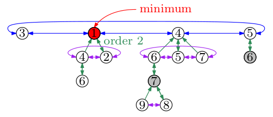

#### Insert operation

- Create a new node and insert into the list of root nodes

- Update pointer to (new) minimum root node if required

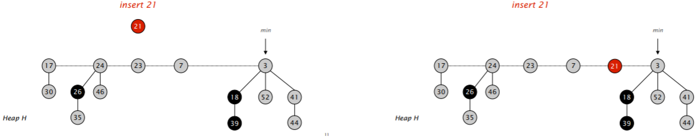

#### Link operation

- If $r_1.key \geq r_2.key$ then make $r_1$ a child of $_2$, otherwise $r_2$ becomes a child of $r_1$.
- Update information on the order of $r_2$ (or $r_1$)

#### Cut operation

- Remove $v$ from the child list of its parent $p$ and insert it into the root list
- Update information on the order of $p$
- Mark $p$

#### DeleteMin

- Delete the root node with the current minimum
- Move its children as new root nodes into the list of root nodes
- Link trees until no pair of nodes has the same order
- Update pointer to minimum root

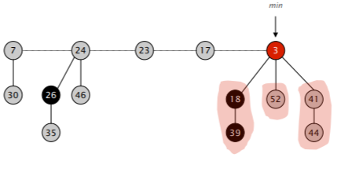

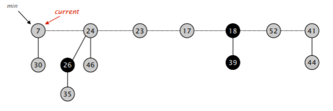

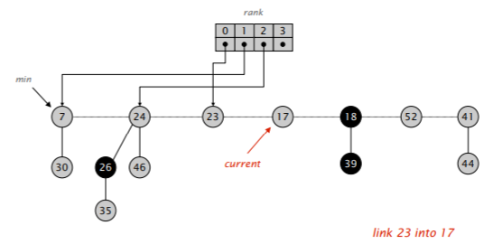

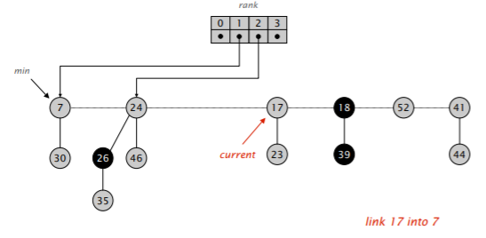

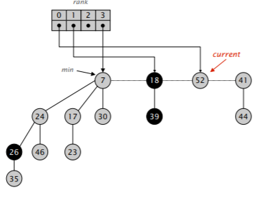

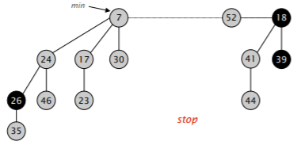

#### DecreaseKey

- If the new key of $v$ is less than the key of the parent $p$ then cut $v$ and move it (with its subtree) to the root list.
- If $p$ is not marked then mark $p$
- Else, cut $p$ and move to root list and apply recursively to its parents
- Update pointer to minimum root

**Case 1:**

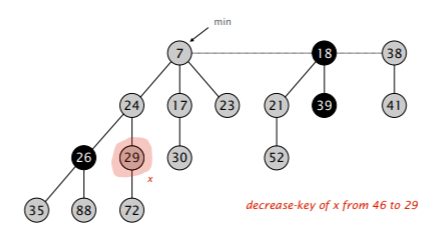

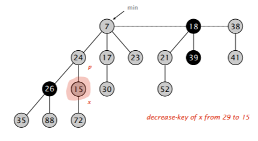

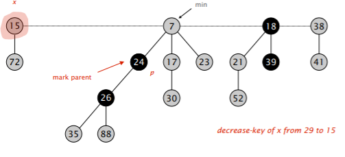

**Case 2:**

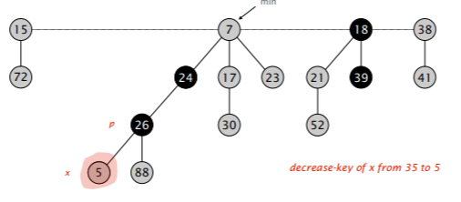

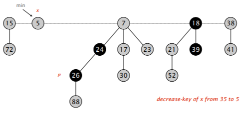

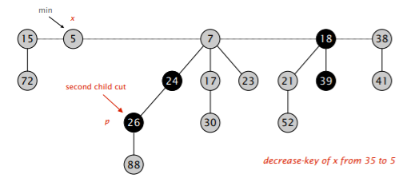

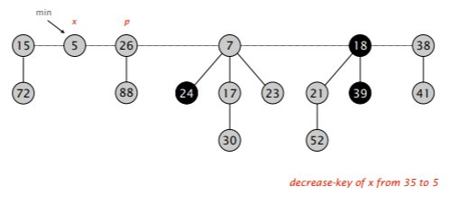

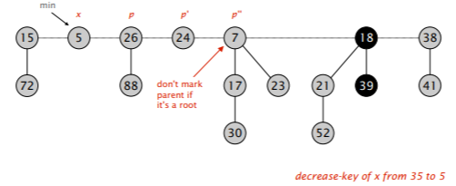

#### Lemma (123)

If only Insert and DeleteMin operations are carried out, then a Fibonacci heap is a binomial heap after every DeleteMin operation.

**Note:** If no consolidation occurs (since no suitable DeleteMin operation is carried out) then a Fibonacci heap with $n$ nodes may degenerate to one single tree, or even to an unsorted linked list (of n root nodes) or an "unary" tree of height $n − 1$.

**Proof:**

By induction: Every DeleteMin results in a consolidation phase during which pairs of trees which have root nodes of the same order are linked.

#### Lemma (124)

If a node of a tree in a Fibonacci heap has $k$ children then it is the root of a subtree with at least $F_{k+2}$ nodes.

#### Corollary (125)

Every node of a tree in a Fibonacci heap with a total of $n$ nodes has at most $O(log(n))$ children.

**Proof:**

Let $k$ be the number of children of a node $v$. By lemma 124, its subtree has $F_{k+2}$ nodes. Hence,

$n \geq F_{k+2} \geq \text{(Lemma 5) } \phi^k$       implying $k \leq log_\phi n$

#### Theorem (126)

When starting from an initially empty heap, any sequence of $a$ Insert, $b$ DeleteMin and $c$ DecreaseKey operations takes $O(a + b \cdot log(n) +c)$ worst-case time, where $n$ is the maximum heap size.

- Hence, from a theoretical point of view, a Fibonacci heap is better than a binomial heap when $c$ is smaller than $b$ by a non-constant factor.
- A Fibonacci heap is also better than a binomial heap when frequent merging of heaps is required.
- However, the worst-case time for one DeleteMin or DecreaseKey operation is linear, which makes Fibonacci heaps less suitable for applications which cannot tolerate excessive running time for individual operation.
- Fibonacci heaps are sometimes reported to be slow in practice due to hidden constants.

### Performance Summary

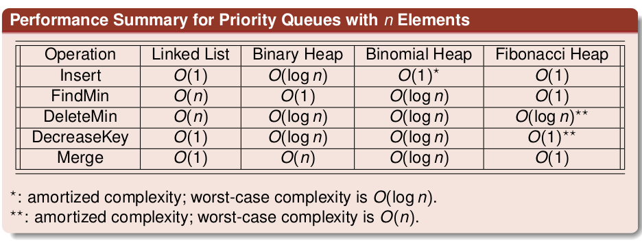

