# Randomized Data Structures for Searching


### Dictionary

A **dictionary** is a collection ADT (abstact data type) that focuses on data storage and retrieval. 

- Data is a key-value pair (KVP), a so-called item: (k,v)
- Standard operations:
  - Insert item (k,v) into structure
  - Retrieve data from structure, i.e., check whether it has an item with a given key k and return the pair (k,v)
  - Delete item from structure
- In addition, a reassign replaces the value in one of the (k,v) pairs in the structure 


### Set

A **set** is a collection ADT that allows to store data items and focuses on efficient membership tests.

- Data items
  - A data item is a key or key-value pair with trivial value
  - The order of the data items does not matter
  - Duplicate data items are not permitted
- Standard operations
  - Insert item into structure
  - Delete item from structure
  - Test membership, i.e., check whether it has an item with a given key $k$
- Core set-theoretic operations for two sets $S$, $T$
  - Union: Compute the union of $S$ and $T$
  - Intersection: Compute the intersection of $S$ and $T$
  - Difference: Compute the difference of $S$ and $T$
  - Subset: Check whether $S$ is a subset of $T$


### Theorem (127)

Comparison-based searching among $n$ elements requires $\Omega(log(n))$ comparisons in the worst case.

**Proof:**

Assume that we want to search for the item that has key $k$ among the items $a_1$, $a_2$, ..., $a_n$. A decision tree $T$ for solving this problem must contain at least $n+1$ leaves.

 - One leaf for each $a_i$, if $k$ is the key of $a_i$
 - One additional leaf for "Not found"

Hence, the height of $T$ is at least $log(n+1) \in \Omega(log(n))$


### Height

The **height** of a rooted tree $T$ is the maximum dept of nodes of $T$ with the root of $T$ being at depth 0.


### Balanced-Tree

A rooted binary tree is (height-balanced) if either it has no proper subtrees or if 
- it has two proper subtrees and the heights of both subtrees differ by not more than 1, or if
- it has exactly one proper subtree of height 0
  and if
- all proper subtrees are height-balanced.


### Theorem (130)

If $T$ is a balanced binary tree with $n$ nodes and height $h$ then $h \in \theta(log(n))$.


### Example: Balanced Search Trees

An example for a self-balancing search tree is the so-called AVL tree named after Adelson-Vel'skii and Landis. Insertion, searching and deleting all take $O(log(n))$ time in both the **average case** and the **worst case** where $n$ is the number of nodes in the tree.

However, of course, we need to "pay" for keeping the tree balanced. AVL insertions require $O(1)$ rotations (two rotations at most), while deletions require $O(log(n))$ rotations in the worst case ($O(1)$ in average). 

Its height is at most $\frac{1}{log(\phi )} log(n) \approx 1.44 \cdot log(n)$.

**Note:** Of course, keeping the tree balances causes some additional overhead. We, therefore, try to relax this requirement by making it less strict.


### Balancing Trees

Once we inserted a new node in the tree, we have to make sure that the tree is still balanced. This done via rotation. To figure out whether a subtree needs to be rotated we calculate a balance factor for every node.

​                                                       $BF = h(\text{Left-Subtree}) - h(\text{Right-Subtree})$


We need to rebalance the tree once the height of any node is $\geq 2$.

#### Examples:

**Right - Right - Tree: ** Requires L-Rotation

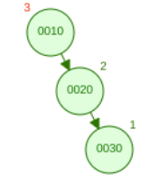


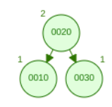


**Right - Left - Tree:** Requires RL-Rotation

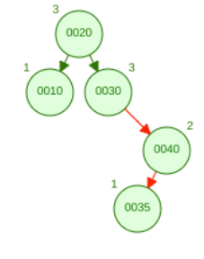

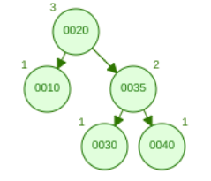

### Random BST

A **randomly buit binary search tree** with $n$ nodes is a binary search tree built by inserting $n$ items/keys in random order.


We can think about it like computing a random permutation of the items - where each permutation is equally likely - and then inserting the items in that order. Still, different permutions may result in the same tree. For instance, 2 -> 1 -> 3 and 2 -> 3 -> 1.

Furthermore, we need to keep in mind that we have no guarantee that our tree is balanced. It depends on the application whether randomness can be assumed. Otherwise, the resulting tree could be highly skewed. For instance, if we insert 10 numbers in random order then the resulting tree will degenerate to a list with probability $2/10!$

Nevertheless, the more nodes, the less likely the tree is degenerate!


### Lemma (131)

The expected time to build a binary search tree with $n$ nodes randomly is $O(n \cdot log(n))$.

**Note:** The worst-case runtime is $\theta(n^2)$ (for sorted inputs). 

**Proof:**

During the construction of a randomly built BST we perform the same comparisons as a randomized QuickSort, but in a different order. Theorem 91 tells us that the expected number of comparisons made by a randomized QuickSort on an array of $n$ numbers is at most $2n \cdot ln(n)$. Hence, we also get an $O(n \cdot log(n))$ expected-time bound.

Idea: Think about running Quicksort and storing the result of the intermediate steps.


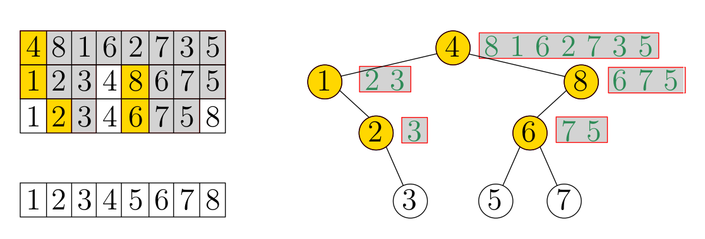


### Lemma (132)

The average node depth of a randomly build binary search tree is $O(log(n))$.

**Proof:**

The depth of a node equals the number of comparisons made during the BST construction. Since all permutations of the keys are equally likely, the average node depth $d_n$ is given by

$d_n = \frac{1}{n} \mathbb{E}[\sum_{i=1}^n(\text{# comparisons for node i})] = \frac{1}{n} O(n \cdot log(n)) = O(log(n))$


### Theorem (133)

A randomly built binary search tree with $n$ nodes has an expected height of $\alpha \cdot ln(n)$, where $\alpha = 4.311$ .... is the unique solution within $[2, \infty]$ of the equation $\alpha \cdot ln(\frac{2e}{\alpha})=1$.


### Randomized Binary Search Tree

A binary search tree $T$ with $n$ nodes is a **randomized binary search tree** (RBST) if either $n=0$ or if, for $n > 0$,

- both its left subtree $L$ and right subtree $R$ are independent randomized binary search trees,
- Pr($L$ has $i$ nodes) = $\frac{1}{n}$    for all $0 \leq i \leq n-1$

An immediate consequence of this definition above is that any of the keys of a random BST of size has the same probability, namely $1/n$, of being the root of the tree.


### Lemma (134)

The expected height of a randomized binary search tree with $n$ nodes is $O(log(n))$.


#### Insertion

In order to produce random BSTs, a newly inserted key should have some chance of becoming the root, or the root of one of the subtrees of the root, and so forth. 

If the tree $T$ is not empty with propability $1/(n+1)$ we place $x$ as the root of the new RBST. Therefore, the new tree will have size $n+1$. With probability $1-1/(n+1) = n/(n+1)$, we recursively insert $x$ in the left or right subtree of $T$ depending on the relation of $x$ with the key at the root of $T$.

```
best_insert(int x, bst T):
	int n, r
	n = T.size
	
	r = random(0,n)
	if(r == n):
		return insert_at_root(x,T)
	if(< T.key):
		T.left = insert(x,T.left)
	else:
		T.right = insert(x,T.right)
		
	return T
```

```
insert_at_root(int x, bst T):
	// use standard BST algorithm to insert x as leaf in T
	
	//perform left/right rotations to move the node containing x all the way up to the root of T
```

```
rotate_left(node w, bst T):
	node u = w.right
	u.parent = w.parent
	if (u != T.root):
		if (u.parent.left == u):
			u.parent.left = w
		else:
			u.parent.right = w
	w.right = u.left
	if(w.right != nill):
		w.parent = u
		u.left = w
	if (w == T.root):
		T.root = u
	
	return
	
rotate_right(node u, bst T):
	node w = u.left
	w.parent = u.parent
	if( u != T.root):
		if (u.parent.left == u):
			u.parent.left = w
		else:
			u.parent.right = w
	u.left = w.right
	if (u.left != nill):
		u.parent = w
		w.right = u
		if (u == T.root):
			T.root = w
			
	return
```


#### Deletion


**Join:**

We make use of a join operation for two RBSTs $L$ and $R$, where all keys in $L$ are assumed to be less than all keys in $R$:

- Let $n_L$ be the size of $L$ and $n_R$ be the size of $R$
- Use root of $L$ as root of the union tree with probability $\frac{n_L}{n_L+n_R}$ and recursively join right subtree of $L$ with $R$
- Use root of $R$ as root of the union tree with probability $\frac{n_R}{n_L+n_R}$ and recursively join $L$ with left subtree of $R$


**Deletion:**

- Search and delete the node that contains the key sought
- Use join operation to join the two subtrees of that node


#### Lemma (135)

Tree is still random after deletion.

```
randomizedJoin(bst L, bst R):
	
	//pick a random number, k, between 1 and (L.size + R.size)
	if (k <= L.size):
		T = L
		T.right = randomizedJoin(L.right, R)
	else:
    	T = R
    	T.left = randomizedJoin(L, R.left)
	
	return T

delete(key x, bst T):
	// search node N such that N.key equals x
	randomizedJoin(N.left, N.right)
	remove(N)
```


### Lemma (135)

Tree is still random after deletion.


#### Theorem (136)

The expected height of a randomized binary search tree with $n$ nodes is $O(log(n))$.
Search, insertion, deletion and join all run in $O(log(n))$ expected time.


### Treaps

A **treap** is a binary tree in which every node stores a priority in addition to the key-value pair such that

- it is a binary search tree on the keys
- it is a max-heap on the priorities where greater number means higher priority


#### Lemma (137)

The structure of a treap is completely determined by the search keys and priorites of its nodes.

**Proof by induction:**

- **IB**
  The base case is a tree with one node which is trivially unique.
- **IH**
  Treaps with $k$ nodes are unique.
- **IS**
  We will know add a new node to our tree with $k$ nodes.
  We know that the structure of a treap is the same as the structure of a binary tree in which the keys are inserted in increasing priority order, the treap with $k+1$ nodes with smallest priority is the same as the treap with $k$ nodes with smallest priority after inserting the $(k+1)$-th node. Since BST insert is a deterministic algorithm, there is only one place the $k$-th node could be inserted. Therefore, the treap with $(k+1)$-th node is unique.


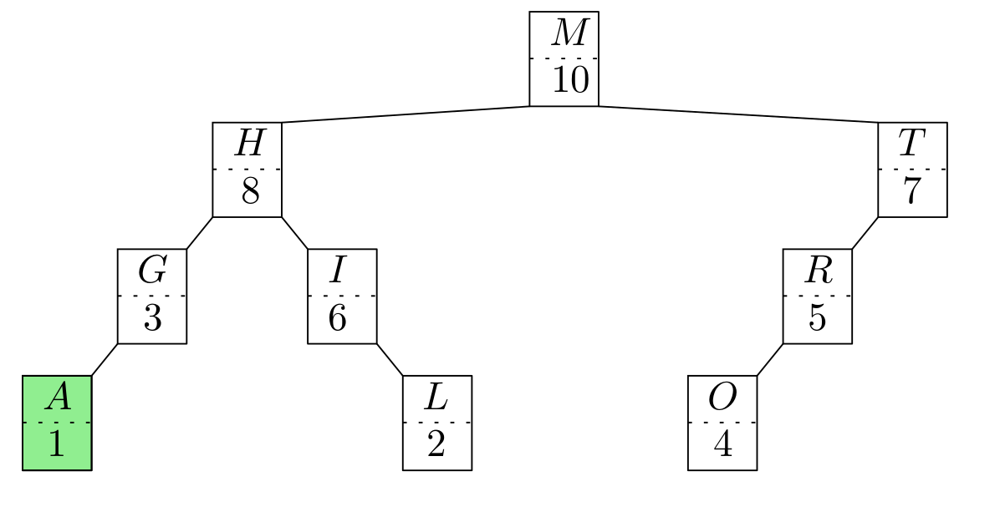


#### Operations

- **Search**
	Since a treap is a BST we can apply the algorithm for searching in a BST

- **Insertion**
	- We use the algorithm for insertion into a BST, thus creating a node z
	- In order to repair the heap structure, we use rotations to "bubble" z upwards as long as z has a greater priority than its parent

- **Deletion**
	- Search the node z sought
	- Use rotations to push z downwards until it becomes a leaf, thereby moving its higher-priority child upwards.

- **Split:** Split treap $T$ into two treaps $T_1$, $T_2$ such that all keys of $T_1$ are less than some given key $x$ and all keys of $T_2$ are greater than $x$.
	- Insert a dummy node with key $x$ and priority $+\infty$ into $T$
	- This node will become the root of the new treap and its subtrees form the two treaps $T_1$, $T_2$ sought.  
	


```
bubbleUp(node z, treap T):
	while( z.parent != NIL && z.parent.p > z.p )
		node u = z.parent
		if (z.parent.right == z):
			rotateLeft(z.parent, T)
		else:
			rotateRight(z.parent,T)
		z = u
		if (z.parent == NIL):
			T.root = z
			
	return
```


### Randomized Treap

A **randomized treap** is a treap in which the priorities are independently and uniformly distributed continuous random variables.

**Note:** When inserting a new key-value pair we generate a random real number between, e.g., 0 and 1, and use that number as the priority of the new node. By using reals as priorities we ensure that the probability of two nodes having equal priority is zero. In practice, choosing a random integer from a large range
or a random floating-point number is good enough.


#### Theorem (139)

The expected height of a treap with $n$ nodes is $O(log(n))$. Search, insertion, deletion and split all run in $O(log(n))$ expected time. The expected number of rotations done during an insertion/deletion is only $O(1)$.


### Sorted Linked List

#### Pros

- Truly simple dynamic data structure that is easy to implement
- No need for an a-priory estimate of the number of elements to be stored
- Easy to insert or delete in $O(1)$ time if position is known

#### Cons

- Difficult to get to the middle of the list; binary search does not work
- Search in $o(n)$ time is difficult


### Perfect Skip Lists

**Goal:** Combine the appealing simplicity of sorted lists with a good expected-time behavior!

**Idea:** Add a second list $L_1$ containing only every second item. Then we need at most $\lceil \frac{1}{2}n \rceil$ comparisons on $L_1$ and, with proper links into the first list $L_0$, one additional comparisons on $L_0$.

If $k$ nested lists are used: At most $\lceil \frac{1}{2^{k-1}} n \rceil$ comparisons on the k-th list $L_{k-1}$, plus one additional comparison in each of the lists $L_0, L_1, ..., L_{k-2}$.


#### Search

To search for an item we start on the list at the top level. In the current list we move towards the sentinel until the key of the next item will be greater than the query key. Then we go down and repeat the procedure until we are in the bottom list $L_0$. In the bottom list $L_0$ we either find the item queried or no such item exists.

When searching for $k$:

- If $k = next.k$:   Done
- If $k > next.k$:   Go Right. Stop at sentinel
- If $k < next.k$:   Go down one level from $L_i$ to $L_{i-1}$. Stop at $L_0$.

```
searchSkipList(key x, skiplist T):
	Node u = T.header
	int h = T.height
	
	while(h >= 0):
		while( u.next[h].key < x):
			u = u.next[h]
		--h
		
	return u
```


#### Insertion

- Insert item into full list $L_0$ (lowest level 0)

- Promote it to the next higher level with (independent) probability $p$

  **Note:** Common choices for $p$ are $1/2$ and $1/4$. The choice of $p$ allows a trade-off between space complexity and query speed.

  In case of $p=1/2$: The highest level of a newly can be determined by repeatedly flipping a coin until the coin comes up heads.

```
insertProbabilisticSkipList(key x, skiplist T):
	Node u = T.header;
	int h = T.height;
	int hx = result of coin flips;
	Node v = CreateNode(x, hx);
	while (h >= 0):
		while (u.next[h].key < x):
			u = u.next[h];
		if (h <= hx):
			v.next[h] = u.next[h];
			u.next[h] = v;
		--h;

	++T.counter_of_nodes;

	return v
```


#### Deletion

- Simply search and remove item from structure


#### Lemma (140)

The expected number of times a fair coin is tossed up to and including the first time the coin comes up heads is 2.

**Proof:**

Let $T$ denote this random variable and define an indicator random variable $I_i$ as $I_i := 1$ if the coin ends up being tossed $i$ or more times, and $I_i := 0$ otherwise. 


Probability that we toss at least 1 times: $Pr(I_1=1) = 1$

Probability that we toss at least 2 times: $Pr(I_2=1) = 0.5$     (First toss needs to be tail)

Probability that we toss at least 3 times: $Pr(I_3=1) = 0.5 \cdot 0.5$   (First + second toss need to be tail)

Therefore, we get:

​                                                      $\mathbb{E}(I_i) = Pr(I_i = 1) = \frac{1}{2^{i-1}}$


However, we since we are interested in the expected value of $T$.

$T= \sum_{i=1}^{\infty} I_i$

$\mathbb{E}(T) = \mathbb{E}(\sum_{i=1}^{\infty} I_i) = \sum_{i=1}^{\infty} \mathbb{E}(I_i) = \sum_{i=1}^\infty \frac{1}{2^{i-1}} = \sum_{i=0}^\infty \frac{1}{2^{i}} = 2$

Hence, the expected number of levels for a newly inserted item is 2.

##### Alternative

Pr(Insert at level 0) = $0.5$

Pr(Insert at level 0,1) = $1/4$

Pr(Insert at level 0,1 ... i) = $1/2^{l+1}$

Hence, we get as the required space = $\sum_{i=1}^\infty \frac{1}{2^i} n = 2n$

#### Lemma (141)

Suppose that we use constant-size nodes, with one node per level if an item is stored in that level. Then the expected number of nodes in a skip list storing n items is $2n$ if we disregard header and sentinel nodes.

**Proof:**

Probability of an item being at $L_0$: $\frac{1}{2^0} = 1$
Probability of an item being at $L_1$: $\frac{1}{2} = 0.5$
Probability of an item being at $L_2$: $\frac{1}{4} = 0.25$

Hence, after $n$ inserts $L_0$ has $1$ elements.
Hence, after $n$ inserts $L_1$ has $\frac{n}{2}$ elements.
Hence, after $n$ inserts $L_2$ has $\frac{n}{4}$ elements.

Hence, the expected number of elements in the list becomes:

$\mathbb{E}(\sum_{i=0}^\infty \frac{n}{2^i}) = n \cdot \sum_{i=0}^\infty \frac{1}{2^i} = 2n$

Hence, a linear storage can be expected to suffice for storing a skip list.


#### Lemma (142)

The expected height of a skip list storing $n$ items is at most $log(n) + 2$.

**Proof:**

The probability that an element gets up to level $L_i$ is $\frac{1}{2^i}$.                                               $p_i = \frac{1}{2^i}$

Hence, the probability that **at least one** element gets up to level $L_i$ after $n$ inserts becomes:

​                                                                $p_i \leq \frac{n}{2^i}$

The probability that the height $h$ is larger than $i$ is equal to the probability that level $i$ has at least one position, that is, it is no more than $p_i$. This means that $h$ is larger than, say, $3 \cdot log(n)$ with probability at most 

​                                                           $p_{3 \cdot log(n)} \leq \frac{n}{2^{3 \cdot log(n)}} = \frac{n}{n^3} = \frac{1}{n^2}$

For example, if $n = 1000$, this probability is a one-in-a-million long shot. More generally, given a constant $c > 1$, $h$ is larger than $c \cdot log(n)$ with probability at most $1/n^{c-1}$ . That is, the probability that $h$ is smaller than $c \cdot log(n)$ is at least  $1 - 1/n^{c-1}$ . Thus, with high probability, the height $h$ of $S$ is $O(log(n))$. 

#### Lemma (143)

The expected length of a search path in a skip list storing $n$ items is $2 \cdot log(n) + 2$.


#### Theorem (144)

A skip list storing $n$ items has expected size $O(n)$ and supports search, insertion and deletion in expected time $O(log(n))$.


#### Extension

- We can count the number of edges in a search path, in order to gain access to the $j$-th item stored in the skip list
	- length of edge in $L_0$ is 1
	- length of edge in $L_i$ is the sum of the lengths of the edges in $L_{i-1}$ below
- To get to the j-th node we
	- go right if the sum of the edge lengths so far plus the length of th next edge is less than j
	- go down otherwise
- This makes it easy to get the j-th item in the sorted list in $O(log(n))$ time and set/modify its value. Of course, we need to take care that the list remains still sorted.


#### Sample application: Rope 

A **rope** is a data structure that is used to efficiently store and manipulate a very long string of characters by maintaining a number of short (sub-)strings.
Operations like insertion, deletion and random access shal be supported efficiently.

Ropes are used in many applications that maintain long strings which change over time. For instance, word processors or text editors.

Let $R := s_0 s_1 ... s_{n-1}$ be a string of length $n$ that is stored as a rope and let $R_1$, $R_2$ be rope strings.

**Rope operations:**
​	- **Concat($R_1$, $R_2$):** Return a rope that contains the concatenation of the strings $R_1$, $R_2$
​	- **Split(R,i):** Truncate $R$ to length $i$ and return a rope that contains the remaining characters
​	- **report(R,i,j):** Return a rope that contains the string $s_i,s_{i+1}, ..., s_{j-1}$
​	- **insert(R, $R_1$, i):** Return rope with string $R_1$ inserted at position $i$ of $R$.
​	- **delete(R,i,j):** Return rope without the string $s_i, s_{i+1},..., s_{j-1}$ of $R$

- Insertion and deletion can be realized by means of the first three operations.

- We can split a skip list at any node in $O(log(n))$ expected time
  - Insert a new sentinel and new header at the desired position
  - Cut old pointers and set up new pointers

- We can also join two skip lists with $n_1$ and $n_2$ nodes in $O(log(max\{ n_1, n_2\}))$ expected time:
	- Set up new pointers
	- Delete sentinel and header


### Direct Addressing

**Goal:** Realize a data structure that supports insert, retrieve and delete operations in $O(1)$ time.

Suppose that every key-value pair has a key drawn from the universe $U := \{ 0,1,...,n-1\}$ for some $n \in \mathbb{N}$. In order to represent a dynamic set $S$ of KVPs we could use a **direct-address table** of size $n$.

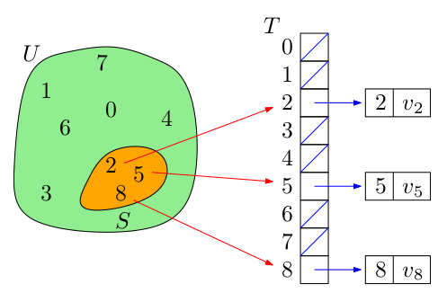


Obviously, each operation (insert, retrieve and delete) runs in $O(1)$ time. However, there are obvious drawbacks:

- If $|U|$ is large then it may be impractical or even impossible to store a table of size $|U|$.
- If $|S| << |U|$, then allocating a table of size $|U|$ is waste of memory.

**Goal:** We cant to trade $O(1)$ worst-case complexity for $O(1)$ average-case complexity and reduce the moroy requirement to $\theta(|S|)$.


### Hashing

A *hash function*, $h: U \rightarrow \mathbb{Z}_m$ maps a key $k$ of the universe $U$ to the slot (aka bucket) $h(k)$ of the hash table $T[0,1,..., m-1]$, for $m \in \mathbb{N}$.


**Problem:** If $|m| < |S|$ and then the pidgeonhole principle implies that at least two keys will hash to the same slot, for any hash function $h$. Depending on our hash function this could also happen for $m \geq |S|$.

Such a situtation is called **collision**.

**Solutions to collisions:**

- **Chaining:** Rather than letting $h(k)$ point to a single memory cell that stores v , we let it point to a list which contains all KVPs whose keys hash to the same slot.
- **Open addressing:** Allow alternate slots instead of $h(k)$. Lazy deletion, insertion is $\theta(1)$ only on average


### Separate Chaining

- Insertion maintains its $O(1)$ worst-case complexity (if we may assume that the KVP to be inserted is not yet presented in the hash table)

- The complexity of retrieving a KVP depends on the (maximum) length of a list

  The worst-case complexity of retrieval: $\theta(n)$ if $n$ KVPs have been stored in the table in a single list

- An actual-deletion of a KVP (upon its prior location) can be done in $O(1)$ time (if doubly-linked lists are used)

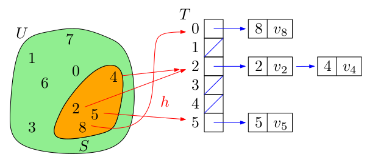


### Load Factor

Let a hash table $T$ store $n$ KVPs in a total of $m$ slots. The loadm factor $\alpha$ of $T$ is defined as:

​                                                          $\alpha := \frac{n}{m}$


### Uniform hashing

A key $k$ is equally likely to has into any of the $m$ slots, independently of where any other key has hashed to.

Hence, with uniform hashing we have: $Pr(h(k) = i) = \frac{1}{m}$   for all $i \in \{0,1,...,m-1\}$ and all $k \in U$

and $\mathbb{E}[n_i] = \sum_{j=0}^{n-1} 1 \cdot Pr(h(k_j) =i) = \frac{n}{m} = \alpha$

**Note:** $n_i$ denotes the number of elements in the $i$-th slot.


### Lemma (146)

If uniform hashing is used and collisions are resolved by chaining then an unsuccessful search runs in expected time $\theta(1+\alpha)$.

**Proof:** Any new key $k$ is equally likely to hash to any of the $m$ slots. The expected time to search unsuccessfully for $k$ in the list of T[h(k)] is the time needed to search the list to its end, which has expected length $\alpha$.

**Note:** The situation for a successful search is slightly differently, since each list is not equally likely to be searched: If all stored KVPs are assumed to be equally likely to be retrieved then the probability that a list is searched is proportional to the number of KVPs which it contains.

Still, one can prove that a successful search can be expected to involve $1 + \frac{\alpha}{2} - \frac{\alpha}{2n}$ items.


### Theorem (147)

It uniform hashing is used and collisions are resolved by chaining then any search runs in expected time $\theta(1+\alpha)$.

Obviously, we want to ensure that $\alpha = O(1)$.


### Re-Hashing

Assume that repeated insertions caused the load factor $\alpha$ to get too big. Then it is common to double $m$, thus getting a new $m^* \approx 2m$ as new size of the hash table, implying a new load factor $\alpha^* \approx \frac{1}{2} \alpha$:

- Find a new hash function $h^*$: $U \rightarrow \mathbb{Z}_{m^*}$
- Re-Hash: Insert each KVP from old has table into new hash table

However, as for dynamic array, this adds $O(m^* + n)$ time to one particular insertion, but happens rarely: It adds $O(1)$ amortized time to insertion.


### Theorem (148)

If uniform hashing - with re-hashing as outlined above - is used and collisions are resolved by chaining then insertion, retrieval and deletion run in expected amortized time $O(1)$.

The worst-case time is $\theta(n)$ for a hash table with $n$ KVPs!


### Hash function: Modular hashing (Division method)

##### Hash function

​                                                                                     $h(k) := k \mod m$

Since it requires only a single division operation, hashing by division is quite fast.

Of course, $m$ needs to be chosen carefully. Let's consider a few cases:

- **$m$ is a power of 2, say $m := 2^p$**

  **For example:** 24 mod 16 = 8 ==> Requires 3 bits in binary representation

  The $p$ lowest-order bits of $k$ are the last $p$ bits when $k$ is written in binary representation. This is a very poor choice unless we were guaranteed that all low-order p-bit patterns of the keys are equally likely.

  **Why should we not choose such a number?** As mentioned above, it's enough to look at the last p-bit numbers. This operation can be done easily with computers (bitwise AND). 

  To get a better understanding, we can also consider the decimal case. If I ask you what is 8237643 mod 10348237643, your response will be to reach for your calculator; if I ask you what is 10008237643 mod 1000, you'll tell me that it's 643643 with barely a thought. This is because $1000=10^3$ is a power of ten, whereas 1034 is not.

  However, we are looking for hash functions that equally distribute data items over the whole hash table. Unless it is known that all low-order p bit patterns are equally likely, it is better to make the hash function depend on all the bits of the key.

- **$m := 2^p -1$**

  If $k$ is a character string interpreted in radix $2^p$, then permuting the characters of $k$ would not result in a different hash value.

  **Example Radix 2p:** 

  Represent the string "abc" using ASCII values in radix 2p. Let $m = 2^3 -1$.

  $x = \sum_{i=0}^{n-1} x_i 2^{ip} = 99 + 98 \cdot 2^{3} + 97 \cdot 2^{6} = 7091$

  **Proof:**

  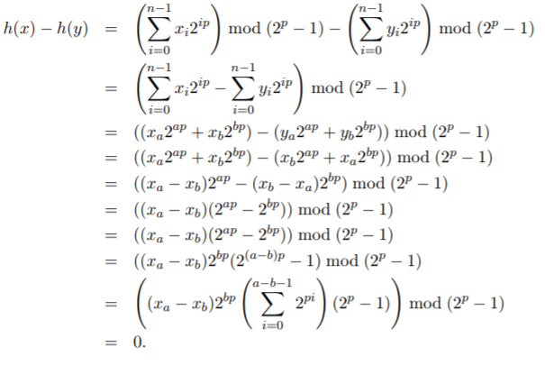

- Prime numbers not too close to a power of 2 (or power of 10) work well in practice as a choice for $m$.


### Hash function: Multiplication Method

##### Hash function

Let $x \in \mathbb{R}$ with $0 < x <1$. Then

​                                              $h(k) := \lfloor m \cdot (x \cdot k \mod 1) \rfloor$

where $x \cdot k \mod 1 := x \cdot k - \lfloor x \cdot k \rfloor$,   i.e., $x \cdot k \mod 1$    is the fractional part of $x \cdot k$.

**Advantage:** Choice of $m$ is less critical

- This is a generalization of modular hashing: 		If $x := \frac{1}{m}$ then

​                            $h(k) = \lfloor m \cdot (\frac{1}{m} \cdot k) \mod 1 \rfloor = \lfloor m \frac{k \mod m}{m} \rfloor= k \mod m$

- Supposedly, $x := \frac{\sqrt{5}-1}{2}$ works well. Fibonacci hashing

- The multiplication method tends to yield hashes with decent "randomness" for the same reason why linear congruential generators work.

  It's like generating a pseudo-random number with hashcode as the seed. Multiplicative hashing is cheaper than modular hashing because multiplication is usually considerably faster than division (or mod).

  **Example:** LCG:   $x_{n+1} = a x_n +b (\mod m)$

- The choice of $m$ is not so critical and there seems to be some disagreement on what is best. It also works well with a bucket size $m=2^p$.

  If $m := 2^p$ and the word size of the machine is $w$ bits, with $p \leq w$, and if the key $k$ fits into one word:

  - Let $x := \frac{s}{2^w}$ for some integer $s$ in the range $0 < s < s^w$
  - Multiply $k$ by $s$
  - This gives a 2w-bit value $A_1 \cdot 2^w + A_0$, where $A_1$ is the high-order word of the product and $A_0$ is the low-order word of the product.
  - Now take the $p$ highest bits of $A_0$.

  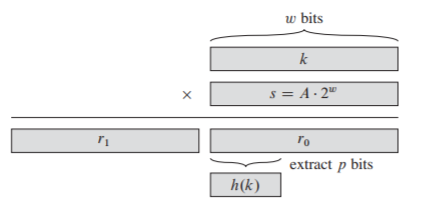

  ​	Note: A = x


- Although this method works with any value of the constant $x$, it works better with some values than with others. The optimal choice depends on the characteristics of the data being hashed.


### Universal Hashing

If a malicious adversary chooses the keys to be hashed by some fixed hash function, then the adversary can choose $n$ keys that all hash to the same slot, yielding an average retrieval time of $\theta(n)$.

Any fixed hash function is vulnerable to such terrible worst-case behavior. The only effective way to improve the situation is to choose the hash function **randomly** in a way that is **independent** of the keys that are actually going to be stored.


#### Definition: Universal hashing

The hash function is chosen randomly (from a diligently designed class of hash functions) in a way which in independent of the keys that will be stored.

**Pro:** As for randomized quicksort, randomization guarantees that no sequence of inputs/operations will always result in a worst-case performance.

**Con:** Universal hashing may behave differently for each exection, even when supplied with the same sequence of inputs/operations.


###  Universal collection of hash functions

Let $m \in \mathbb{N}$ and $H$ be a finite collection of hash functions that map a universe $U$ of keys to $\{ 0,1,...,m-1\}$. This collection of has functions is **universal** if

​                                                               $|\{ h \in H: h(k) = h(i) \}| \leq \frac{|H|}{m}$

for each pair of distinct keys $k,i \in U$.

In words: A collection is said to be **universal** if for each pair of distinct keys $k$, $i$, the number of hash functions $h \in H$ for which $h(k) = h(i)$ is at most $|H|/m$. 


### Lemma (150)

Let $m \in \mathbb{N}$ and $H$ be a universal collection of hash functions. Consider a pair of distinct keys $k,i \in U$ and pick a hash function $h$ randomly from $H$. Then

​                                                                              $Pr[h(k) = h(i)] \leq \frac{1}{m}$

for each pair of distinct keys $k,i \in U$.

In other words, with a hash function randomly chosen from $H$, the chance of a collision between distinct keys $k$ and $l$ is no more than the chance $1/m$ of a collision if $h(k)$ and $h(l)$ were randomly and independently chosen from set $\{ 0,1, ..., m-1\}$.

**Proof:**

By definition there are at most $\frac{|H|}{m}$ hash functions with $h(k) = h(i)$. 

Hence, the probability that we pick one if these hash functions is $Pr[h(k) = h(i)] \leq \frac{\frac{|H|}{m}}{|H|} = \frac{1}{m}$.


### Theorem (151)

Let $m \in \mathbb{N}$ and $H$ be a universal collection of hash functions. Pick a hash function $h$ randomly from $H$ and suppose that it has been used to hash $n$ keys into a hash table $T$ of size $m$, with separate chaining used to resolve collisions.

If key $k$ is not in the table, then the expected number of elements at position $h(k)$ becomes:

​                                                                               $\mathbb{E}(n_{h(k)}) \leq \alpha$


If key $k$ is in $T$ then the expected number of elements becomes:

​                                                                               $\mathbb{E}(n_{h(k)}) \leq 1+ \alpha$

**Proof:**

We first define an indictor variables $C_{ki}$ that indicates whether two keys map to the same slot.

​                                                         $C_{ki} = \begin{cases} 1 \hspace{1cm } \text{ if  } h(k) = h(i) \\ 0 \hspace{1cm } \text{otherwise} \end{cases}$

But, what's the probability for any hash function $h$ that two randomly and independently chosen keys $k$ and $i$ map to the same slot? Well, we know that $Pr[h(k)=h(i)] \leq \frac{1}{m}$, so we can conclude that

​                                                            $Pr[C_{ki}=1] \leq \frac{1}{m}$

However, we are now looking for the expected number of elements at a certain position after inserting $n$ elements. First, let's define the random variable $L_k$. It denotes the number of keys (exept $k$) that hash to the list that contains $k$.

​                                                               $\mathbb{E}[L_k] = \mathbb{E}[\sum_{l \in T; i \neq k} C_{ki}] = \sum_{l \in T; i \neq k} \mathbb{E}[C_{ki}] $

​                                                                                     $\mathbb{E}[L_k] \leq \frac{1}{m}$

The remainder of the proof depends on whether key $k$ is in table $T$.

- If $k \not\in T$: Then $n_{h(k)} = L_k$ and  $|i: i \in T \setminus \{k\}|=n$

  ​                                                             $\mathbb{E}[n_{h(k)}] = \mathbb{E}[L_k] \leq \frac{n}{m} = \alpha$

- If $k \in T$: Then $n_{h(k)} = L_k +1$ and  $|i: i \in T \setminus \{k\}| = n-1$

  ​                                               $\mathbb{E}[n_{h(k)}] = \mathbb{E}[L_k] + 1\leq \frac{n-1}{m} + 1= \alpha = \alpha - \frac{1}{m} + 1 < 1 + \alpha$


The following theorem (152) says universal hashing provides the desired payoff: it has now become impossible for an adversary to pick a sequence of operations that forces the worst-case running time. By cleverly randomizing the choice of hash function at run time, we guarantee that we can process every sequence of operations with a good average-case running time.


### Theorem (152)

Let $T$ be an initially empty hash table with $m$ slots with separate chaining used to resolve collisions. If universal hashing is used then any sequence of $N$ inserts, retrieve and delete operations that contains $O(m)$ insert operations runs in $\theta(N)$ espected time.

**Proof:**

Since the number of insertions is $O(m)$, we have $n=O(m)$ and so $\alpha = \frac{O(m)}{m} = O(1)$. 

Since insert and delete operations take constant time and, by Theorem 151 the expected time for search operation is $O(1)$. By linearity of expection, the expected time of the entire sequence is $O(N)$. Since every operation takes $\Omega(1)$ time, the $\theta(n)$ bound follows.


### Definition (153)

For $a \in \mathbb{Z}_p^*$ and $b \in \mathbb{Z}_p$ we define the hash function $h_{a,b,p,m}$ as follows:

​                                                $h_{a,b,p,m}(k) := ((a \cdot k + b) \mod p ) \mod m$

Then

​                                                             $H_{p,m} := \{ h_{a,b,p,m}: a \in \mathbb{Z}_p^+, b \in \mathbb{Z}_p\}$


**Please note:**

$\mathbb{Z}_p^*$     .....   $\{1,...,p-1\}$

$\mathbb{Z}_p$     .....   $\{0,1,...,p-1\}$


In words: A hash function $h_{a,k,p,m}$ for any $a \in \mathbb{Z}_p^*$ and any $b \in \mathbb{Z}_p$ using a linear transformation followed by reductions modulo $p$ and the modulo $m$.

**Example:**

For instance, $p=17$ and $m=6$, we have $h_{3,4,17,6}(8) = 5$. This class of hash functions has the nice proprety that the size $m$ of the output range is arbitrary - not necessarily prime. 

- Each hash function $h_{a,b,p,m}$ maps $\mathbb{Z}_p$ to $\mathbb{Z}_m$

- Since we have $p-1$ choices for $a$ and $p$ choices $b$, the collection contains $p(p-1)$ hash functions.

**In practice:**

- Choose a prime number $p$ large enough so that every possible key $k$ is in the range $0$ to $\{p-1\}$
- Because we assume that the size of the universe is greater than the number of slots in the hash table, we have $p >m$.
- Since $p$ is prime, we can solve equations modulo $p$ with the method shown in section "Multiplication Method"


### Theorem (154)

The class $H_{p,m}$ is a universal collection of hash functions.

**Note:**

This class of hash functions has the nice property that the size $m$ of the output range is arbitrary - not necessarily prime. Since we have $p-1$ choices for $a$ and $p$ choices for $b$, the collection $H_{p,m}$ contains $p(p-1)$ hash functions.


### String as Keys

Most hash functions assume that all keys belong to $\mathbb{N}_0$. The standard way to map a character string $s$ to an integer: Interpret the string as an integer expressed in a suitable radix notation and then use the radix interpretation as key.

**Important:** The radix interpretation can be truly huge! Hence, apply modulo computations early and do
not compute the powers of the radix explicitly.

```
string_modular_hash(string s, int R, int M):
	N = S.length - 1
	int h = S[N]
	for (i=N-1; i >= 0; --i):
		h *= R
		h += S[i]
		h = h mod M
		
	return h
```

**Example:**

Length = 3	N = 2

((S[2] * R + S[1] ) mod M   * (R + S[0])) mod M   = (S[2]*R^2 + S[1]^R + S[0]) mod M


### Perfect Hashing

Although hashing is often a good choice for its excellent average-case performance, hashing can also provide excellent worst-case performance when the set of keys is **static** (no inserts and deletes; just: Once the keys are stored in the table, the set of keys never changes.

Some applications naturally have static sets of keys: consider the set of reserved words in a programming language, or the set of file names on a CD-ROM.

We call a hashing technique **perfect hashing** if $O(1)$ memory accesses are required to perform a search in the worst case.

**Approach:**
To create a perfect hashing scheme, we use two levels of hashing with universal hashing at each level.
The first level is essentially the same as for hashing with chaining: We hash $n$ keys into $m$ slots using a hash function $h$ carefully selected from a family of universal hash functions. However, we use a small secondary hash table $S_j$ with an associate hash function $h_j$. By choosing the hash function $h_j$ carefully, we guarantee that there are no collisions at the secondary level.

In order to guarantee that there are no collisions at the secondary level, however, we will need to let the size $m_j$ of hash table $S_j$ be the square of the number $n_j$ of keys hashing to slot $j$.

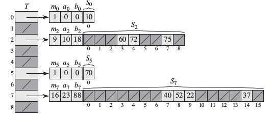


#### Definition

**Perfect hashing** is a two-level hash scheme, with universal hashing at each level. The
secondary hashing is injective, thus guaranteeing $\theta(1)$ search time for a set of keys
known a priori.


We use hash functions chosen from the universal class of hash functions. The first-level has functions comes from the class $H_{pm}$ where $p$ is a prime number greater than any key value and $p > m$. Those keys hashing to slot $j$ are re-hashed into a secondary hash table of size $m_j$ using a hash function $h_j$ chosen from the class $H_{p,m_j}$.

We shall proceed into two steps. First, we shall determine how to ensure that the secondary tables have no collisions. Second, we shall show that the expected amount of memory used overall - for the primary hash table all the secondary hash tables is $O(n)$.


### Lemma (155)

If we store $n$ keys in a hash table of size $m := n^2$ by using a hash function randomly chosen from a universal collection of hash functions, then we get collisions with a probability of less than $\frac{1}{2}$.

**Proof:**

There are ${n}\choose{2}​$ pairs of keys that may collide. Each pair collides with probability $1/m​$ if $h​$ is chosen at random from a universal family $H​$ of hash functions. Let $X​$ be a random variable that counts the number of collisions. When $m=n^2​$, the expected number of collisions is

$\mathbb{E}[X] = $${n} \choose{2}$ $\cdot \frac{1}{n^2}$

$ = \frac{n \cdot (n-1)}{2} \cdot \frac{1}{n^2} = \frac{n-1}{n} \cdot \frac{1}{2} < \frac{1}{2}$


Markovs inequality implies:

$Pr(X \geq a) \leq \frac{\mathbb{E}[X]}{a}$

$Pr(X \geq 1) \leq \frac{\mathbb{E}[X]}{1} < \frac{1}{2}$

Hence, after trying a few randomly chosen hash functions, we will have found a hash function that does not yield collisions with very high probability. The probability that we have found a hash function without collisions after trying $i$ hash functions is at least $1 - \frac{1}{2^i}$.

If $Y​$ is a random variable that represents the number of hash functions that need to be tried until no collision occurs. We have

​                                                     $\mathbb{E}[Y] = \sum_{i=1}^\infty 1 \cdot Pr(Y \geq i) \leq \sum_{i=1}^\infty \frac{1}{2^{i-1}} = \sum_{i=0}^\infty \frac{1}{2^i} = 2$


However, when $n$ is large, a hash table of size $m = n^2$ is excessive. Therefore, we adopt the two-level hashing approach. We only hash the entries within each slot. The first-level hash function $h$ hashes the keys into $m=n$ slots.  Then, if $n_j$ keys has to slot $j$, we use a secondary hash table $S_j$ of size $m_j = n_j^2$ to provide collision-free constant-time lookup.


