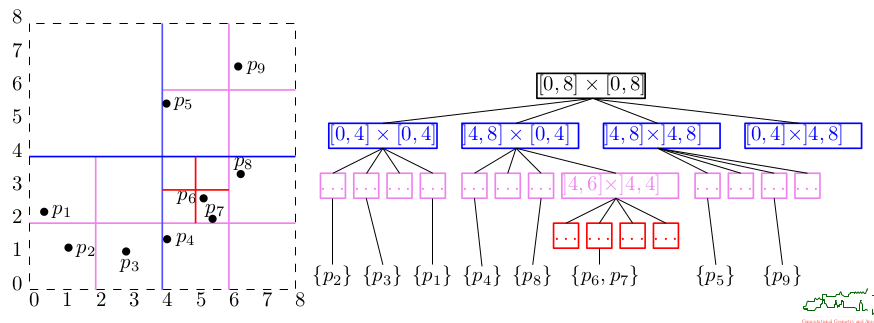
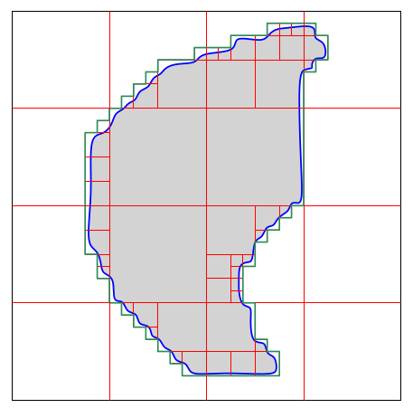

# Geometric Searching

### Query Types
- **Point-Inclusion Query**
  In which "cell" (of, e.g., a map) does a query point lie?
- **Range Searching:**
  - **Report Query:** Which points are within a query object (rectangle, circle)?

  - **Count Query:** Only the number of points within an object matters
- **Single-Shot Query:** Only one query per data set
- **Repetitive-Mode Query:** Many queries per data set; preprocessing may make sense

- The complexity of a query is determined relative to four cost measures
  - query time
  - preprocessing time
  - memory consumption 
  - update time

### Problem: RangeSearchReport

**Given:** A set $S$ of $n$ points in $\mathbb{R}^k$ and query (hyper-)rectangle $R$.

**Report:** Those points of $S$ which are within $R$.

**Case $k=1$:**    Then rectangle $R$ is an interval

- As preprocessing we sort the points. This needs $O(n \cdot log(n))$ time.
- A query is solved by a binary search which needs $O(log(n) + m)$ time, where $m$ is the (output-sensitive) number of points returned.

**Case $k \geq 2$:**    The goal is to "extend" binary search to higher dimensions.

For points $p_1, ..., p_n$ in $\mathbb{R}^2$ we build a kd-tree (k-dimensional binary search tree) as preprocessing:

- We start by finding the median $p_m$ of the points with respect to their x-coordinates.
- The point $p_m$ becomes the root fo the tree; it's labeled "vertical"
- We divide the plane by a vertical straight line through $p_m$ into two half-planes
- Within each half-plane we find the medians with respect to the y-coordinates of the respective points
- These two points are called "horizontal" nodes and become the left and the right child of the root
- The recursive subdivision, alternating between x- and y-coordinates continues until all points form nodes of the tree.

### Theorem (159)

Range searching based on a kd-tree in two dimensions needs $O(n \cdot log(n))$ preprocessing time, with $O(n)$ space complexity. A query can be carried out in $O(\sqrt{n} + m)$, where $m$ is the number of nodes reported.

**Sketch of proof:**

We focus on the query complexity. Fix one supporting line $l$ of the query rectangle. W.l.o.g., $l$ is vertical. Let $Q^x(n)$ be the maximum number of nodes of the kd-tree which are discriminated relative to $l$ if the root of the kd-tree is split according  to x-coordinate. Similarly for $Q^y(n)$.

​                                 $Q^x(n) = 1+ Q^y(\frac{n}{2})$                     and                 $Q^y(n) = 1+ Q^x(\frac{n}{2})$

Induction allows to show:

​                                                                 $Q^x(n) = 2 + 2Q^x(\frac{n}{4})$

The Master Theorem tells us that $Q^x \in O(\sqrt{n})$ and, thus, also $Q^y \in O(\sqrt{n})$. Hence, $O(\sqrt{n})$ nodes are discriminated relative to the four supporting lines of the query rectangle.

- The complexity of building a kd-tree does not change if no pre-sorting is carried out and linear-time and a linear-time algorithm for median finding is used for identifying the nodes of the tree.
- More efficient methods are known. But kd-trees are very versatile tool in dimensions.

### Theorem (160)

Range searching based on a k-dimensional kd-tree needs $O(k \cdot n \cdot log(n))$ preprocessing time, with $O(n)$ space complexity. A query can be carried ou tin $O(k \cdot n^{1-1/k} + m)$ time, where $m$ is the number of nodes reported.

**Important:** The curse of dimensionality for large values of $k$: We ought to have $n >> 2^k$ in order to make kd-trees practical.

### Quadtree

We subdivide the (rectangular) workspace recursively into four sub-recangles ("cells") by bisecting it in both x and y. The recursion stops when either a cell contains at most one point or a maximum depth - i.e., minimum cell size - is reached.

- Range queries in such a (point) quadtree are very similar to queries in a kd-tree
- Insertion and deletion of points are supported easily
- Quadtrees are simple and easy to implement and tend to be quite efficient in practice
- **Problem:** Even just three points can result in a quadtree of huge height
- Higher dimensions: In $\mathbb{R}^d$ split into $2^d$ hyper-rectangles. Therefore, it's rarely used for $d>3$. When $d=3$ we use an octree instead.

### Theorem (161)

Consider a quadtree on the distinct points $p_1, p_2, ..., p_n$ such that every cell is either empty or contains one point. Then its height is $\theta(\Delta)$, where 

​                                                        $\Delta := \frac{max_{i \leq i < j \leq n} d(p_i,p_j)}{min_{i \leq i < j \leq n} d(p_i,p_j)}$

### Applications

Quadtrees and octrees are widely used for representing a shape approximately: region quadtree and region octree.

### Problem: NearestNeighborSearch

**Given:** A set $S$ of $n$ points in the Euclidean plane

**Compute:** The point of $S$ which is closest to a query point $q$, for a given point $q$.

- We do already know that the worst-case complexity of **NearestNeighborSearch** for $n$ points has an $\Omega(log(n))$ lower bound.
- Easy to solve in $O(n)$ time per query.
- A worst-case optimum $O(log(n))$ query is possible based on tools of computational geometry.

### Regular Rectangular Grid

Let $S := \{p_1, p_2, ..., p_n\}$.

The bounding box of $S$ (or of a larger region that contains $S$) is partitioned into rectangular cells of uniform size by means of a regular grid. For every cell $c$, all points of $S$ that lie in $c$ are stored in a list associated with $c$. That is, the cells of the grid become the slots of the standard hash table, and the hash function assigns a point $p \in S$ to $c$ if and only if $p$ lies within $c$.

Determine the cell $c$ in which the query point $q$ lies. By searching in $c$ (and possibly in its neighboring cells, if $c$ is empty), we find a first candidate for the nearest neighbor. Let $\delta$ be the distance from $q$ to this point.

We continue searching in $c$ and in those cells around $c$ which are intersected by a disk $D$ with radius $\delta$ centered at $q$. Whenever a point of $S$ is found that is closer to $q$ than $\delta$, we reduce $\delta$ appropriately.

The search stops once no unsearched cell exists that is intersected by the disk $D$.

**Grid resolution:**

What is a suitable resolution of the grid? There is no universally valid answer. In any case, the grid should not use more than $O(n)$ memory.

**Experience:** Grids of the form $(w \cdot \sqrt{n}) \times (h \cdot \sqrt{n})$ seem to work nicely, with $w \cdot h = c$ for some constanc $c$. The parameters $w,h$ are chosen to adapt the resolution of the grid to the aspect ratio of the bounding box of the points. By experiments: $1 \leq c \leq 2$

- This basic schema can be tuned considerably
  - Switch to multi-level hashing or to kd-trees if a small sample of the points indicates that the points are distributed non-uniformly
  - Adapt the grid resolution and re-hash if the number of points stored changes significantly due to insertions and deletions of points

- Hash-based nearest-neighbor searching will work best for points that are distributed uniformly and will fail miserably if the points end up in one cell. Nevertheless, geometri hashing seems to work well in practice.

- Geometric hashing can also be used to answer (generalized range) queries quite efficently. For instance, one may need to report those points of $S$ that lie within a query triangle. Then it suffices to check those points of $S$ which are stored in cells overlapped by (the bounding box of) the triangle.

