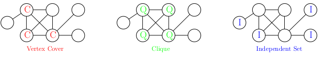
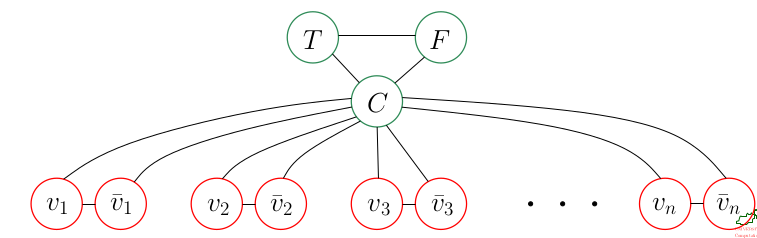
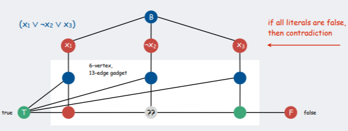

## Hard Problems and Approximation Algorithms

### Polynomially solvable

A problem $P$ is **solvable** in **polynomial time** if there exists a polynomial $P$ such that a solution for every instance of $P$ can be obtained in time $O(p)$ where the size of the instance / input forms the argument of the polynomial.

**Example for polynomial time bounds:** $O(n)$, $O(n \cdot log^2(n))$, $O(2^{1000} \cdot n^2 \sqrt{n})$, $O(n^{1000})$

Motivation for distinguishing between polynomial and non-polynomial problems:

- If a problem is not solvable in polynomial time then there is absolutely no hope for an efficient (exact) solution for absolutely all large inputs. Such problems are considered **intractable**.
- Polynomials are solved under complement. If $p$ and $q$ are polynomials then $p \cdot q$ is a polynomial for most "standard" operations (closed under addition, multiplication and composition). For example, if the output of one polynomial-time algorithm is fed into the input of another, the composite algorithm is polynomial. Despite much work by many researchers, no one even knows whether the class NP is closed under complement. That is, does $L \in NP$ imply $\bar{L} \in NP$
- If a problem of size $n$ is solvable in time $f (n)$ on one model of computation then it is also solvable in $f (p(n))$ on another model of computation, for virtually all "natural" models of computation and polynomials $p$.
- The polynomial-time computable problems encountered in practice typically require much less time. Experience has shown that once the first polynomial-time algorithm for a problem has been discovered, more efficient algorithms often follow. Even if the current best algorithm for a problem has a running time of $\theta (n^{100})$, an algorithm with a much better running time will likely soon be discovered.

### Problem Class $P$

The problem class $P$ is the class of all decision problems that are solveable in polynomial time by a deterministic algorithm.

### Non-deterministic Polynomial-time solution

A **non-deterministic algorithm solves a decision problem $P$ in polynomial time** if there is a fixed polynomial $p$ such that for each instance $x$ of $P$ for which the answer is "yes" there is at least one execution of the algorithm that returns "yes" in at most $p(|y|)$ time.

**What is a non-deterministic algorithm?**

Roughly, a non-deterministic algorithm consists of a "guessing" phase and a "verifying phase".

- **Guessing:** An arbitary string $s$ of characters is generated
- **Verifying:** An deterministic algorithm takes the input and the string $s$. It may use or ignore $s$ during its computation. Eventually, it returns "yes" or "no", or it may get in an infinite loop and never halt.

The time consumed by a non-deterministic algorithm is the time needed to write $s$ plus the time consumed by the deterministic verifying phase.

### Problem Class $NP$

The problem class $NP$ is the class of all decision problems that are solveable in polynomial time by non-deterministic algorithms.

It is the class of languages that can be **verified** by a polynomial-time algorithm. In other words, we can easily find a certificate $s$ for an instance if the answer is "yes". But there exists a polynomial-time algorithm to check the validatiy of a proposed certificate $s$.

**Note:** NP stands for "non-deterministic polynomial time"

### Lemma (166)

We have $P \subseteq NP$.

**Sketch of Proof:** Let $P \in P$. All we need to do is to apply a deterministic algorithm that solves $P$ in polynomial time and let it ignore any non-determinism.

**Note:**

It is not clear whether $P$ is a proper subset of $NP$. However, it is widely believed that $P \notin NP$.

### Polynomially reducible

A decision problem P is **polynomially reducible** (or simply **reducible**) to a decision problem $Q$, denote by $\text{P} \leq_p Q$, if there exists a reduction from $\text{P}$ to $Q$ that runs in polynomial time.

### Lemma (168)

For two decision problems $\text{P},Q$, if $\text{P} \leq_p Q$ and $Q \in \text{P}$ then $\text{P} \in P$.

**Proof:** Let $x$ be an instance of P. We apply a polynomial reduction and map $x$ in time $p(|x|)$ to an instance $t(x)$ of $Q$. Since $Q \in \text{P}$, a solution to $t(x)$ can be obtained in time $q(p(|x|))$, where $q(|\alpha|)$ denotes the time needed for solving an instance $\alpha$ of $Q$.

### NP-hard

A problem $Q$ is **NP-hard** if every problem $\text{P} \in NP$ is polynomially reducible to $Q$.

**Note:** Class of decision problems which are at least as hard as the hardest problems in NP. Problems that are NP-hard do not have to be elements of NP; indeed, they may not even be decidable.

### NP-complete

A problem $Q$ is NP-complete if it is in $NP$ and if it is NP-hard.

### Lemma (171)

We have $\text{NP-complete} \subseteq NP$ and $\text{NP-complete} \subset \text{NP-hard}$.

### Theorem (172)

If some NP-complete problem is in $P$ then $P = NP$.

**Proof:**

If an NP-complete problem P is in $P$ then all problems of $NP$ can be reduced in polynomial time to P and, thus, also solved in polynomial time.

### Theorem (173)

The satisfiability problem of propositional logic, SAT (Satisfiability), is NP-complete.

### NP-complete decision problems

#### Problem: SAT-CNF

**Given:** A propositional formula $A$ which is conjunctive normal form.

**Decide:** Is $A$ satisfiable?

**Note:**

Conjunctive normal form (CNF) is an approach to Boolean logic that expresses formulas as conjunctions of clauses with an AND or OR. Each clause connected by a conjunction, or AND, must be either a literal or contain a disjunction, or OR operator. CNF is useful for automated theorem proving.

#### Problem: 3-SAT-CNF

**Given:** A propositional formula $A$ which is in conjunctive normal form such that every clause consists of exactly (or at most) three literals.

**Decide:** Is $A$ satisfiable?

#### Problem: Subset Sum

**Given:** A set $S$ of $n$ natural numbers and a number $m \in \mathbb{N}$.

**Decide:** Does a subset of the numbers of $S$ add up to exactly $m$?

#### Problem: Bin Packing

**Given:** A set $S$ of $n$ objects with size $s_1, s_2, ..., s_n \in \mathbb{Q}$, where $0 < s_i \leq q$, and a number $k \in \mathbb{N}$.

**Decide:** Do the objects fit into $k$ bins of unit capacity.

#### Problem: Knapsack

**Given:** A knapsack of capacity $c \in \mathbb{N}$ and $n$ objects with sizes $s_1, s_2, ..., s_n$ and "profits" $p_1, p_2, ..., p_n$. In addition, we are given a number $k \in \mathbb{N}$.

**Decide:** Is there a subset of the objects that fits into the knapsack and achieves a total profit of at least $k$?

**Note:** The decision problem is NP-complete, but the optimization problem is NP-hard (weaker than NP-complete)! The resolution is at least as difficult as the decision problem, and there is no known polynomial algorithm which can tell, given a solution, whether it is optimal.

#### Problem: Set Cover

**Given:** A set $S$ and a family $S := \{ S_1, S_2, ..., S_m\}$ of $m$ subsets of $S$, for $m \in \mathbb{N}$ and a natural number $k \in \mathbb{N}$.

**Decide:** Do there exist at most $k$ subsets $S_{i_1}, S_{i_2},...,S_{i_k} \in S$ such that $S = S_{i_1} \cup S_{i_2} \cup ... \cup  S_{i_k}$?

#### Problem: Hamiltonian Cycle (HC)

**Given:** An undirected graph $G$.

**Decide:** Does $G$ contain a Hamiltonian cycle?

**Hamiltonian Cycle:** A Hamiltonian cycle (or Hamiltonian circuit) is a Hamiltonian Path such that there is an edge (in graph) from the last vertex to the first vertex of the Hamiltonian Path.

#### Problem: Hamiltonian Path (HP)

**Given:** An undirected graph $G$.

**Decide:** Does $G$ contain a Hamiltonian path?

**Hamiltonian Path:** Path in an undirected or directed graph that visits each vertex exactly once.

#### Problem: Traveling Salesman Problem (TSP)

**Given:** A weighted and undirected graph $G$ and a number $c \in \mathbb{R}^+$.

**Decide:** Does $G$ contain a Hamiltonian cycle whose total cost is less than $c$?

**Note:** Again, the optimization problem is NP-hard!

#### Problem Minimum Steiner Tree (MST)

**Given:** A weighted and undirected graph $G = (V,E)$, a set of required nodes ("terminals") $T \subset V$, and a number $c \in \mathbb{R}^+$.

**Decide:** Does there exist a connected subgraph $(V', E')$ of $G$ such that $T \subseteq V'$ and the sum of the costs of the edges of $E'$ is less than $c$?

### Problem: Vertex Cover

**Given:** An undirected graph $G = (V,E)$ and a number $k \in \mathbb{N}$.

**Decide:** Does there exist a vertex cover that has $k$ vertices? A subset $C \subseteq V$ of the vertices of a graph $G$ forms a vertex cover of $G$ if very edge of $E$ is touched by at least one vertex of $C$.

#### Problem: Clique

**Given:** An undirected graph $G = (V,E)$ and a number $k \in \mathbb{N}$.

**Decide:** Does $G$ have a clique of size $k$? A subset $Q \subseteq V$ of the vertices of a graph $G$ forms a clique of $G$ if every pair of distinct vertices of $Q$ is linked by an edge of $E$.

#### Problem: Independent Set

**Given:** An undirected graph $G = (V,E)$ and a number $k \in \mathbb{N}$.

**Decide:** Does $G$ have an independent set of size $k$? A subset $I \subseteq V$ of the vertices of a graph $G$ forms an independent set if no pair of vertices of $I$ is connected by an edge of $E$.

#### Problem: k-Coloring

**Given:** An undirected graph $G= (V,E)$ and an integer $k \in \mathbb{N}$.

**Decide:** Does $G$ admit a coloring that uses at most $k$ colors? An assignment of colors to all vertices of $V$ is called a (vertex) coloring if adjacent vertices are assigned different colors.

### Other problems

#### Problem: Euclidean Traveling Salesman Problem (ETSP)

Given a set of points P in the 2-d plane, the planar ETSP problem is to find a tour of minimum total
distance that visits all points in P exactly once, where the distance between points is the Euclidean (L2) distance. 

**ETSP is NP-hard**, but not known to be in $NP$.

ETSP, and several other optimization problems involving Euclidean distance, are not known to be in $NP$ due to a "technical twist": For ETSP, the length of a tour on $n$ points is a sum of n square roots. Comparing this sum to a number c may require very high precision, and no polynomial-time algorithm is known for
solving this problem. (e.g., repeated squaring of n square roots may lead to numbers that need 2 $n$ bits to store.)

### What NP-complete does not imply?

- Solving an NP-complete problem does not "necessarily" require exponential time: Otherweise, we would have $P \neq NP$!

  **Note:** There exist sub-exponential time solutions: $O(2^{log(n^{log(log(n))})})$

- NP-completeness does not imply that absolutely all instances of a problem are difficult

- NP-complete problems are not the "most difficult" problems. They have a runing time that is exponential, but the decision algorithm for *Resburger arithmetic* for a statement of length $n$ has a worst-case running time of at least $2^{2^{cn}}$, for some constant $c>0$.

### Theorem (175)

If $\text{P} \leq_p Q$ and P is NP-complete, and $Q \in NP$ then $Q$ also is NP-complete.

**Proof:** Let R bin in $NP$. We reduce an instance x of $R$ to an instance $t_1(x)$ of P and $t_1(x)$ to an instance $t_2(t_1(x))$ of Q. This reduction runs in polynomial time. Hence, every problem that is in $NP$ can be reduced polynomially to Q.

**Steps:**

- Show that $Q \in NP$
- Pick problem P that is known to be NP-complete.
- Construct or, at least, prove the existence of a polynomial reduction from P to Q.

### Lemma (176)

If 3-COL is NP-complete then 4-col is NP-complete

**Proof:**

Suppose that 3-COL is NP-complete and 4-COL is in NP. We show that $3-COL \leq_p 4-COL$.

Consider a graph $G=(V,E)$. We transform $G$ into a graph $G'=(V',E')$ by adding one special vertex $v$ to $V$. Also, we add edges from $v$ to all nodes of $V$. Also, we add edges from $v$ to all nodes of $V$.

That is,

- $V' := V \cup \{v\}$, and
- $E' := E \cup \{uv: u \in V\}$

Obviously, this transformation can be carried out in polynomial time in the number of nodes and edges of $G$.

As $v$ consumes one color which cannot be used for any other node of $G'$, the graph $G$ can be colored with three colors exactly if $G'$ can be colored with four colors.

### Corollary (177)

If k-COL is NP-complete for some $k \in \mathbb{N}$ then (k+1)-COL is NP-complete.

### Lemma (178)

3-COL is NP-complete.

**Proof:**

Clearly, 3-COL is in NP. We prove 3-SAT-CNF $\leq_p$ 3-COL. Given a 3-CNF expression $e$, where every clause consists of exactly three literals. We show how to construct a graph $G$ in polynomial time such that $e$ is satisfiable if and only if $G$ can be colored with three colors.

Let $k$ denote the number of clauses of $e$. The variables appearing in $e$ are denoted by $v_1, v_2, ..., v_n$.

**Construction of $G_v$:**

-  Three special nodes - denoted by $C$ (Control), $T$ (True) and $F$ (False) - are linked into a triangle, the so-called control triangle
- For each variable $v$ we create two nodes - the "literal nodes" $v$ and $\bar{v}$ - and link them with the node $C$ and with each other form a triangle
- This gives $2n +3$ nodes and $3n +3$ edges constructed so far for $G_v$

Clearly, three colors are necessary and sufficient to color $G_v$. Obviously, due to control node $C$, the variable nodes $v_i$ and $\bar{v_i}$ have to use the same colors as the nodes T and F. If the colors of $v_i$ and T match, then the colors of F and $\bar{v_i}$ have to match, too.

**Construction of $G_c$:**

Construct a graph $G_c$ as follows:

### Hamiltonian Triangulation

A triangulation (of points or of polygonal figures) is Hamiltonian if its dual graph admits a Hamiltonian cycle.

### Theorem (180)

Testing whether a given simple polygon has a Hamiltonian triangulation can be done in $O(|E|)$ time, where $|E|$ is the number of visible graph edges in the polygon.

### Theorem (181)

Given a simple polygon with (simple polygonal) holes, it is NP-complete to determine whether there exists a Hamiltonian triangulation of its interior.

### Dealing with NP-hard problems

- Many combinatorial optimization problems could be solved by a brute-force enumeration of all possibilities. For instance, we could solve ETSP for $n$ cities by enumerating all (n-1)! possible tours.
- In short terms: An algorithm whose running time is $2^n$ or worse is all but useless for most practical applications.
- According to legend, the power of exponential growth was already known by the Brahmin Sissa ibn Dahir (ca. 300-400 AD): As a reward for the invention of the game of chess (or its Indian predecessor Chaturanga) he asked his king, Shihram, to place one grain of rice in the first square of a chessboard, two in the second, four in the third, and so on, doubling the amount of rice up to the 64-th square.
- While proving a problem to be NP-hard/complete might constitute quite an achievement, it tends to shed little light on how to solve it.

